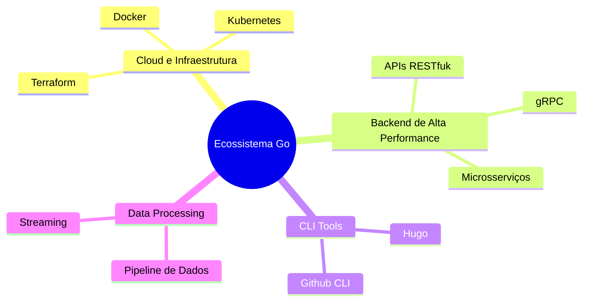

# Aula 01 - Introdução ao Go e Ecossistema 🐹

!!! tip "Objetivo"
    **Objetivo**: Compreender a origem, a filosofia e os diferenciais da linguagem Go, além de configurar o ambiente de desenvolvimento e executar o primeiro programa.

---

## 1. O que é Go? 🚀

Desenvolvida pelo Google em 2007 (e lançada em 2009), **Go** (ou Golang) foi criada para resolver desafios reais de engenharia de software em larga escala. Seus criadores — Robert Griesemer, Rob Pike e Ken Thompson — buscaram uma linguagem que fosse eficiente como C++, mas simples de ler e escrever como Python.

### 🏛️ Os Pilares da Linguagem
Go não tenta ser a linguagem com mais recursos, mas sim a mais **produtiva** para sistemas modernos:

*   **Simplicidade**: A especificação da linguagem é pequena e fácil de aprender.
*   **Eficiência**: Compilada diretamente para código de máquina (sem máquinas virtuais).
*   **Concorrência Nativa**: Goroutines e Channels tornam o processamento paralelo simples e leve.
*   **Segurança**: Tipagem forte e estática, com gerenciamento automático de memória (Garbage Collector).

---

## 2. Por que escolher Go? ⚖️

| Característica | 🐹 Go | 🐍 Python | ☕ Java |
| :--- | :--- | :--- | :--- |
| **Velocidade** | Ultra-rápida (Compilada) | Lenta (Interpretada) | Média (JIT) |
| **Binário** | Único e estático | Precisa de interpretador | Precisa de JVM |
| **Concorrência** | Nativa e leve | GIL (limitado) | Threads pesadas |
| **Curva de Aprendizado**| Rápida | Muito rápida | Média |

### Onde o Go brilha? (Mermaid)



---

## 3. Instalação e Setup 🛠️

Para começar a programar em Go, siga estes passos:

1.  **Download**: Acesse [go.dev/dl](https://go.dev/dl/) e baixe a versão para seu SO.
2.  **Verificação**: Abra o terminal e verifique se o Go foi instalado corretamente.

```termynal
$ go version
go version go1.22.x windows/amd64
```

3.  **Editor**: Recomendamos o **Visual Studio Code** com a extensão oficial **Go** (da Google).

---

## 4. Estrutura de um Programa Go 📂

Todo arquivo Go deve seguir uma estrutura básica:

```go
package main // 1. Declaração do pacote

import "fmt" // 2. Importação de dependências

// 3. Função principal (ponto de entrada)
func main() {
    fmt.Println("Olá, Gophers! 🐹")
}
```

*   **package main**: Indica que este arquivo é um executável, não uma biblioteca.
*   **func main()**: É o primeiro código a ser rodado quando o binário inicia.

---

## 5. Seu Primeiro Programa: "Hello, World" 🚀

Vamos criar e rodar seu primeiro código:

```termynal
# Crie um diretório para seus estudos
$ mkdir estudos-go
$ cd estudos-go

# Inicialize um módulo (gerenciador de dependências)
$ go mod init meu-projeto

# Crie o arquivo principal
$ touch main.go

# (Edite o arquivo com o código acima)

# Execute diretamente sem compilar
$ go run main.go
Olá, Gophers! 🐹

# Ou compile para um binário executável
$ go build main.go
$ ./main  # Ou main.exe no Windows
```

---

## 6. Mini-Projeto: Dashboard do Sistema 📊

Como desafio inicial, crie um programa chamado `perfil.go` que imprima no console:
1.  Seu nome.
2.  Sua idade.
3.  Uma frase sobre por que você quer aprender Go.

> **Dica**: Use `fmt.Println()` para cada linha.

---

## 7. Exercícios de Fixação 🧠

1.  Quem são os criadores originais da linguagem Go?
2.  Qual a principal diferença entre `go run` e `go build`?
3.  Para que serve o comando `go mod init`?

---

**Próxima Aula**: Vamos mergulhar nos [Fundamentos da Linguagem](./aula-02.md), explorando variáveis e tipos! 🧱

