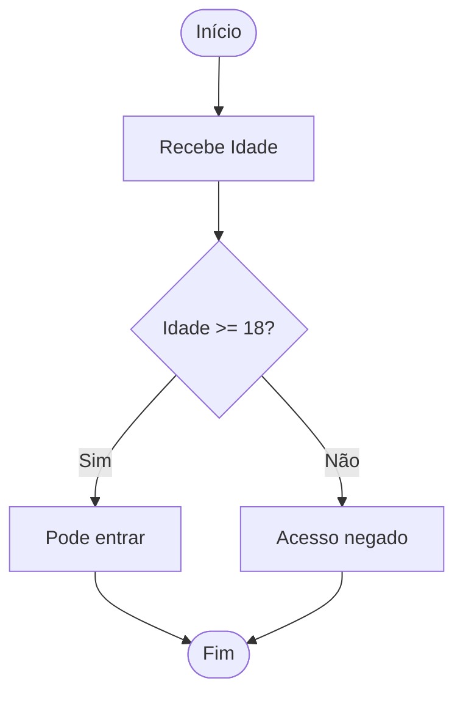

# Aula 02 - Fundamentos da Linguagem 🧱

!!! tip "Objetivo"
    **Objetivo**: Dominar os blocos de construção essenciais do Go: tipos de dados, variáveis, operadores e as estruturas de controle de fluxo.

---

## 1. Variáveis e Constantes 📦

Em Go, existem diversas formas de declarar variáveis, mas a linguagem preza pela clareza e tipagem forte.

### Declaração Explícita vs Curta
```go
// Forma longa (com tipo)
var nome string = "Gopher"

// Forma curta (inferência de tipo - apenas dentro de funções)
idade := 25 

// Constantes (valores que não mudam)
const Pi = 3.1415
```

---

## 2. Tipos Primitivos 💎

Go possui tipos bem definidos para garantir eficiência de memória:

*   **Inteiros**: `int`, `int8`, `int64`, `uint` (sem sinal).
*   **Decimais**: `float32`, `float64`.
*   **Booleanos**: `bool` (`true`, `false`).
*   **Textos**: `string` (UTF-8 por padrão!).

> [!IMPORTANT]
> Go não faz conversão implícita de tipos. Você não pode somar um `int` com um `float64` sem converter um deles manualmente.

---

## 3. Estruturas Condicionais 🚦

O controle de fluxo em Go é simples e direto.

### If / Else
Note que não usamos parênteses nos testes condicionais!

```go
if idade >= 18 {
    fmt.Println("Maior de idade")
} else {
    fmt.Println("Menor de idade")
}
```

### Switch
O `switch` em Go é poderoso e não precisa de `break` em cada caso (ele para automaticamente).

```go
switch dia {
case "Sábado", "Domingo":
    fmt.Println("Fim de semana! 🎉")
default:
    fmt.Println("Dia de codar! 💻")
}
```

---

## 4. Estruturas de Repetição 🔁

Aqui está uma curiosidade: **Go só tem uma palavra-chave para loops: `for`**. Mas ele assume várias formas.

### For Tradicional
```go
for i := 0; i < 5; i++ {
    fmt.Println("Contagem:", i)
}
```

### For como "While"
```go
contador := 0
for contador < 3 {
    fmt.Println(contador)
    contador++
}
```

---

## 5. Visualização de Fluxo (Mermaid) 📊



---

## 6. Mini-Projeto: Calculadora de IMC 🚀

Crie um programa `imc.go` que:
1.  Declare variáveis para `peso` (float64) e `altura` (float64).
2.  Calcule o IMC (`peso / (altura * altura)`).
3.  Use um `if/else` ou `switch` para classificar:
    *   IMC < 18.5: Abaixo do peso.
    *   18.5 a 24.9: Peso normal.
    *   >= 25: Acima do peso.

---

## 7. Exercícios de Fixação 🧠

1.  Qual a diferença entre usar `var x = 10` e `x := 10`?
2.  O que acontece se você declarar uma variável em Go e não usá-la? (Dica: tente compilar!)
3.  Como criar um loop infinito em Go?

---

**Próxima Aula**: Vamos aprender a organizar nosso código com [Funções e Módulos](./aula-03.md)! 🧩🧱🚀
