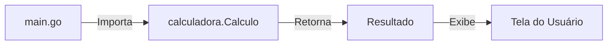

# Aula 03 - Funções e Organização do Código 🧩

!!! tip "Objetivo"
    **Objetivo**: Aprender a estruturar projetos em Go usando funções, pacotes e entender o conceito fundamental de ponteiros.

---

## 1. Funções em Go ⚙️

As funções são cidadãs de primeira classe em Go. Elas podem ser passadas como argumentos, retornadas por outras funções e muito mais.

### Sintaxe Básica e Múltiplos Retornos
Diferente de C ou Java, Go permite retornar mais de um valor, o que é muito usado para tratamento de erros.

```go
func dividir(a, b float64) (float64, error) {
    if b == 0 {
        return 0, fmt.Errorf("divisão por zero")
    }
    return a / b, nil
}
```

### Funções Variádicas
Funções que aceitam um número variável de argumentos (como o próprio `fmt.Println`).

```go
func somarTudo(numeros ...int) int {
    total := 0
    for _, n := range numeros {
        total += n
    }
    return total
}
```

---

## 2. Ponteiros: Onde mora o dado? 📍

Ponteiros permitem acessar o endereço de memória de uma variável. Em Go, usamos ponteiros principalmente para **performance** (evitar cópia de dados grandes) ou para **modificar** um valor dentro de uma função.

*   `&`: Operador "endereço de" (onde está?).
*   `*`: Operador "valor no endereço" (o que tem lá?).

```go
func dobrar(n *int) {
    *n = *n * 2 // Modifica o valor original na memória
}
```

---

## 3. Organização Profissional: Pacotes e Módulos 📂

Go organiza o código em **Pacotes** (Pastas).

1.  **Exportação**: Em Go, se uma função ou variável começa com **Letra Maiúscula**, ela é pública (exportada). Se começa com minúscula, é privada.
2.  **Módulos**: Definidos pelo arquivo `go.mod`, gerenciam as dependências do projeto.

---

## 4. Visualização de Estrutura de Projeto (Termynal) 📂

```termynal
$ tree
.
├── go.mod            # Definição do módulo
├── main.go           # Ponto de entrada
├── calculadora/      # Pacote personalizado
│   └── aritmetica.go # Funções (ex: somar, subtrair)
└── utils/            # Outro pacote
    └── logger.go
```

---

## 5. Fluxo de Execução (Mermaid) 📊



---

## 6. Mini-Projeto: Conversor de Medidas Modular 🚀

Crie um projeto com a seguinte estrutura:
1.  Um pacote `conversor` com funções exportadas: `CelsiusParaFahrenheit` e `KmParaMilhas`.
2.  Um arquivo `main.go` que importa o pacote `conversor` e exibe os resultados na tela.

---

## 7. Exercícios de Fixação 🧠

1.  Como você ignora um dos retornos de uma função em Go?
2.  Qual a diferença entre passar um parâmetro por valor e por ponteiro?
3.  O que define se uma função de um pacote pode ser acessada por outro pacote?

---

**Próxima Aula**: Vamos explorar as [Estruturas de Dados Avançadas](./aula-04.md): Slices, Maps e Structs! 🗄️
