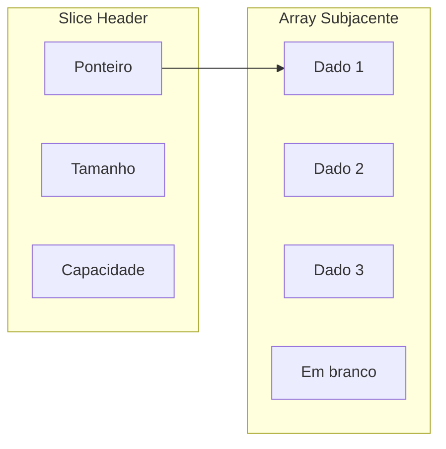

# Aula 04 - Estruturas de Dados Avançadas 🗄️

!!! tip "Objetivo"
    **Objetivo**: Entender como Go gerencia conjuntos de dados usando Arrays, Slices e Maps, além de criar tipos personalizados com Structs.

---

## 1. Arrays vs Slices 🍕

Embora parecidos, eles funcionam de forma muito diferente em Go.

### Arrays (Tamanho Fixo)
Raramente usados diretamente em Go, pois seu tamanho faz parte do tipo.
```go
var notas [3]int = [3]int{10, 8, 9}
```

### Slices (Tamanho Dinâmico)
O "queridinho" do Go. É uma abstração poderosa sobre o Array.
```go
// Criando um slice vazio
frutas := []string{"Maçã", "Banana"}

// Adicionando elementos
frutas = append(frutas, "Uva")

// Fatiando (Slicing)
subFrutas := frutas[0:2] // Pega do índice 0 até o 1
```

---

## 2. Maps: Chave e Valor 🗝️

Maps são coleções desordenadas de pares chave-valor (semelhante a Dicionários no Python ou Objetos no JS).

```go
// Declarando um map
estoque := make(map[string]int)

// Adicionando dados
estoque["teclado"] = 50
estoque["mouse"] = 30

// Verificando se uma chave existe
valor, existe := estoque["monitor"]
```

---

## 3. Structs: Criando seus Próprios Tipos 🏗️

As **Structs** são a forma de Go agrupar diferentes tipos de dados em uma única entidade (como um "objeto" sem classes).

```go
type Usuario struct {
    ID    int
    Nome  string
    Ativo bool
}

// Inicializando
user := Usuario{ID: 1, Nome: "Ricardo", Ativo: true}
```

### Métodos Associados
Você pode "anexar" funções a uma struct, transformando-as em métodos.

```go
func (u Usuario) Saudacao() {
    fmt.Printf("Olá, meu nome é %s\n", u.Nome)
}
```

---

## 4. Visualização de Memória (Mermaid) 📊



---

## 5. Exemplo de Manipulação (Termynal) 💻

```termynal
$ go run main.go
Lista original: [A B C]
Após append: [A B C D]
Mapa de Preços: map[cafe:5.5 pão:1.2]
```

---

## 6. Mini-Projeto: Sistema de Gerenciamento de Alunos 🚀

Crie um programa `escola.go` que:
1.  Defina uma struct `Aluno` com Nome e Notas (um slice de float64).
2.  Crie uma função que receba um `Aluno` e calcule a média das notas.
3.  No `main`, crie um map onde a chave é o CPF (string) e o valor é a struct `Aluno`.
4.  Imprima a lista de alunos e suas respectivas médias.

---

## 7. Exercícios de Fixação 🧠

1.  O que acontece com a capacidade de um Slice quando ele atinge o limite e você faz um `append`?
2.  Como você remove um elemento de um Map?
3.  Posso ter uma Struct dentro de outra Struct? (Composição)

---

**Próxima Aula**: Vamos entender [Interfaces e Programação Orientada a Composição](./aula-05.md), o segredo da flexibilidade do Go! 🧩🐹