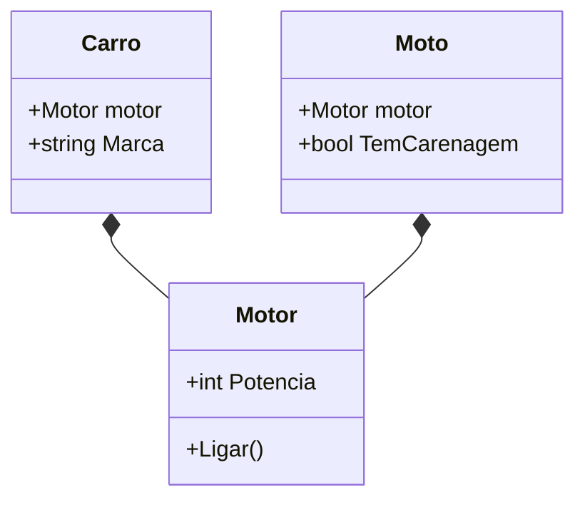

# Aula 05 - Interfaces e Programação Orientada a Composição 🧩

!!! tip "Objetivo"
    **Objetivo**: Compreender o conceito de Interfaces em Go, como elas permitem o polimorfismo e por que a composição é preferível à herança tradicional.

---

## 1. O que são Interfaces? 🔌

Em Go, uma **Interface** define um conjunto de métodos, mas não os implementa. Ela funciona como um "contrato". Se um tipo (geralmente uma struct) possui todos os métodos definidos na interface, dizemos que ele **implementa** essa interface.

### Exemplo: A Interface `Som`
```go
type Animal interface {
    FazerSom() string
}

type Cachorro struct{}
func (c Cachorro) FazerSom() string { return "Au Au!" }

type Gato struct{}
func (g Gato) FazerSom() string { return "Miau!" }
```

Note que não usamos a palavra `implements`. Go faz isso de forma implícita (Duck Typing)!

---

## 2. Polimorfismo na Prática 🎭

Graças às interfaces, podemos criar funções que aceitam qualquer tipo que se "comporte" de uma certa maneira.

```go
func EmitirSom(a Animal) {
    fmt.Println(a.FazerSom())
}
```

---

## 3. Composição: O "Jeito Go" de Reutilizar Código 🏗️

Go não possui herança de classes. Em vez disso, usamos a **Composição** (Embedding).

```go
type Motor struct {
    Potencia int
}

type Carro struct {
    Motor // O carro "tem um" motor (embedding)
    Marca string
}
```

Isso torna o sistema muito mais flexível e evita as armadilhas de hierarquias complexas de classes.

---

## 4. Princípios SOLID em Go 🛡️

*   **S (Single Responsibility)**: Structs focadas.
*   **O (Open/Closed)**: Aberto para extensão via interfaces.
*   **L (Liskov Substitution)**: Interfaces garantem que o substituto funcione.
*   **I (Interface Segregation)**: Interfaces pequenas são melhores (ex: `io.Reader`).
*   **D (Dependency Inversion)**: Dependa de abstrações (interfaces), não de implementações.

> [!TIP]
> "Quanto maior a interface, mais fraca a abstração." — Rob Pike.

---

## 5. Visualização de Composição (Mermaid) 📊



---

## 6. Mini-Projeto: Sistema de Pagamentos Diversos 🚀

Crie uma interface `MetodoPagamento` com o método `Pagar(valor float64)`.
1.  Implemente a struct `Cartao` e a struct `Boleto`.
2.  Crie uma função `ProcessarCompra` que receba a interface e realize o pagamento.

---

## 7. Exercícios de Fixação 🧠

1.  Preciso declarar explicitamente que uma Struct implementa uma Interface em Go?
2.  O que é uma "Interface Vazia" (`interface{}`) e quando ela deve ser evitada?
3.  Qual a vantagem da Composição sobre a Herança?

---

**Próxima Aula**: Vamos aprender a lidar com o inevitável: o [Tratamento de Erros](./aula-06.md) em Go! ⚠️🐹
