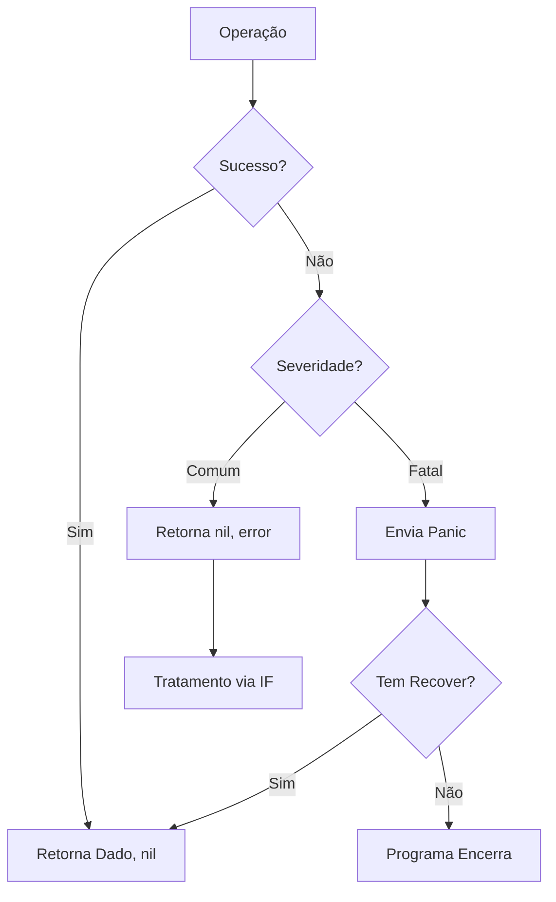

# Aula 06 - Tratamento de Erros ⚠️

!!! tip "Objetivo"
    **Objetivo**: Entender a filosofia de tratamento de erros em Go, a importância do tipo `error`, além de saber quando usar `Panic` e `Recover`.

---

## 1. Erros não são Exceções! 🧊

Em Go, erros são **valores**. Não existe `try/catch`. Se uma função pode falhar, ela retorna um valor do tipo `error` como seu último retorno.

### O Padrão `if err != nil`
Esta é a frase mais famosa do Go. Quase todo código Go profissional verifica erros dessa forma:

```go
arquivo, err := os.Open("dados.txt")
if err != nil {
    fmt.Println("Erro ao abrir arquivo:", err)
    return
}
// Se chegou aqui, o arquivo foi aberto com sucesso
defer arquivo.Close()
```

---

## 2. Criando Erros Customizados 🛠️

Você pode criar seus próprios erros usando o pacote `errors` ou formatando strings com `fmt.Errorf`.

```go
var ErroSaldoInsuficiente = errors.New("saldo insuficiente para a operação")

func Sacar(valor float64) error {
    if valor > saldo {
        return ErroSaldoInsuficiente
    }
    return nil
}
```

---

## 3. Panic e Recover 🚨

O `panic` deve ser usado apenas para erros irrecuperáveis (fatais). O `recover` permite capturar um panic e evitar que o programa caia.

*   **Panic**: Para o fluxo normal, executa os `defer` e encerra o programa.
*   **Recover**: Retoma o controle dentro de uma função que sofreu um panic.

```go
func protegida() {
    defer func() {
        if r := recover(); r != nil {
            fmt.Println("Recuperado de um desastre:", r)
        }
    }()
    panic("ALGO DEU MUITO ERRADO!")
}
```

---

## 4. Diferenciando Erros de Panics (Mermaid) 📊



---

## 5. Boas Práticas de Erro 💡

1.  **Não ignore erros**: Nunca use `_` para descartar o retorno de um erro.
2.  **Contexto é tudo**: Adicione contexto ao erro antes de retornar: `fmt.Errorf("erro no banco: %v", err)`.
3.  **Defer**: Use `defer` para garantir que recursos (arquivos, conexões) sejam fechados, mesmo que ocorra um erro.

---

## 6. Mini-Projeto: Sistema de Validação de Senha 🚀

Crie uma função `ValidarSenha(senha string) error` que retorne:
*   Um erro se a senha tiver menos de 8 caracteres.
*   Um erro se a senha não contiver ao menos um número.
*   `nil` se estiver tudo certo.

No `main`, peça a senha ao usuário e trate os possíveis erros.

---

## 7. Exercícios de Fixação 🧠

1.  Por que Go não usa `try/catch`?
2.  Para que serve a palavra-chave `defer`?
3.  Qual a diferença entre `errors.New` e `fmt.Errorf`?

---

**Próxima Aula**: Vamos aprender a persistir dados com [Manipulação de Arquivos e JSON](./aula-07.md)! 📁🐹
