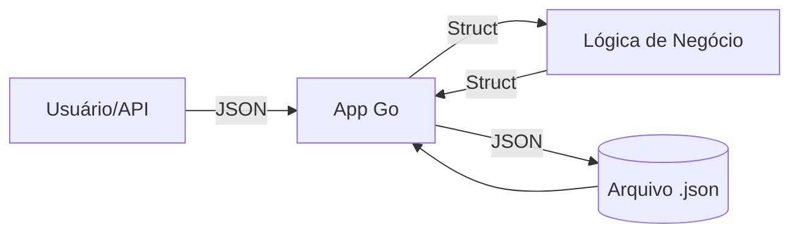

# Aula 07 - Manipulação de Arquivos e JSON 📁

!!! tip "Objetivo"
    **Objetivo**: Aprender a ler e escrever arquivos no disco e a trabalhar com serialização/desserialização de dados no formato JSON.

---

## 1. Lendo e Escrevendo Arquivos ✍️

O pacote `os` e o `io/ioutil` (ou `os` diretamente em versões mais novas) são as ferramentas para lidar com o sistema de arquivos.

### Escrita Simples
```go
dados := []byte("Olá, mundo Go!")
err := os.WriteFile("notas.txt", dados, 0644)
```

### Leitura Simples
```go
conteudo, err := os.ReadFile("notas.txt")
fmt.Println(string(conteudo))
```

---

## 2. Trabalhando com JSON 🏗️

O JSON é o padrão de comunicação para APIs modernas. Em Go, usamos **Struct Tags** para mapear os campos da struct para os nomes das chaves no JSON.

```go
type Produto struct {
    Nome  string  `json:"nome_produto"`
    Preco float64 `json:"preco"`
}
```

### Serialização (Struct -> JSON)
```go
p := Produto{Nome: "Monitor", Preco: 899.90}
jsonDados, _ := json.Marshal(p)
```

### Desserialização (JSON -> Struct)
```go
var p2 Produto
json.Unmarshal(jsonDados, &p2)
```

---

## 3. Fluxo de Dados (Mermaid) 📊



---

## 4. Manipulação via Terminal (Termynal) 💻

```termynal
$ cat config.json
{
  "versao": "1.0",
  "porta": 8080
}

$ go run main.go
Lendo configurações...
Servidor rodando na porta 8080
```

---

## 5. Encoder e Decoder 🚀

Para lidar com grandes fluxos de dados ou arquivos JSON diretamente, usamos `json.NewEncoder` e `json.NewDecoder`. Isso é mais eficiente que carregar tudo na memória com `Marshal`.

---

## 6. Mini-Projeto: CLI To-Do List 🚀

Crie um programa que permita:
1.  Adicionar tarefas a uma lista (struct `Tarefa`).
2.  Salvar essa lista em um arquivo chamado `tarefas.json` sempre que uma tarefa for adicionada.
3.  Carregar as tarefas existentes ao iniciar o programa.

---

## 7. Exercícios de Fixação 🧠

1.  Para que servem as "Struct Tags" (ex: `json:"nome"`)?
2.  Qual a diferença entre `json.Marshal` e `json.NewEncoder`?
3.  O que acontece se um campo da struct não tiver uma tag JSON?

---

**Próxima Aula**: Prepare-se para o poder das [Goroutines e Channels](./aula-08.md)! ⚡🐹