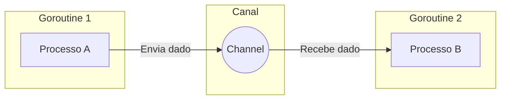

# Aula 08 - Concorrência em Go ⚡

!!! tip "Objetivo"
    **Objetivo**: Entender o modelo de concorrência do Go baseado em Goroutines e Channels, aprendendo a criar programas que executam múltiplas tarefas simultaneamente.

---

## 1. Concorrência vs Paralelismo 🧩

*   **Concorrência**: Lidar com muitas coisas ao mesmo tempo (composição de tarefas independentes).
*   **Paralelismo**: Fazer muitas coisas ao mesmo tempo (execução simultânea em múltiplos núcleos).

Go foi desenhada para tornar a concorrência **fácil** e **barata**.

---

## 2. Goroutines: Threads Levíssimas 🪶

Uma **Goroutine** é uma função que executa de forma independente. Para iniciar uma, basta usar a palavra-chave `go`.

```go
func dizer(s string) {
    fmt.Println(s)
}

func main() {
    go dizer("Olá") // Inicia em segundo plano
    fmt.Println("Mundo")
}
```

Uma Goroutine consome apenas **2KB** de memória inicial, permitindo rodar milhões delas em uma máquina comum!

---

## 3. Channels: A Comunicação Segura 📡

"Não comunique compartilhando memória; compartilhe memória comunicando."

**Channels** são os tubos que permitem às Goroutines trocarem dados de forma segura, sem precisar de travas (locks) complexas.

```go
canal := make(chan string)

go func() {
    canal <- "Dados enviados!" // Envia
}()

msg := <-canal // Recebe (bloqueia até chegar algo)
```

---

## 4. O Select: Um Switch para Canais 🚦

O `select` permite que uma Goroutine espere por múltiplas operações de comunicação.

```go
select {
case msg1 := <-c1:
    fmt.Println("Recebi de c1:", msg1)
case msg2 := <-c2:
    fmt.Println("Recebi de c2:", msg2)
case <-time.After(time.Second):
    fmt.Println("Timeout! ⏰")
}
```

---

## 5. Visualização de Canais (Mermaid) 📊



---

## 6. Mini-Projeto: Web Crawler Básico 🚀

Crie um programa que receba um slice de 5 URLs e:
1.  Dispare uma Goroutine para cada URL.
2.  Cada Goroutine deve imprimir o tempo que levou para "acessar" aquela URL (use `time.Sleep` para simular).
3.  Use um canal ou `WaitGroup` para garantir que o `main` espere todas terminarem.

---

## 7. Exercícios de Fixação 🧠

1.  O que acontece se você enviar um dado para um canal e ninguém estiver lendo? (Deadlock!)
2.  Qual a diferença de memória entre uma Thread comum (OS) e uma Goroutine?
3.  Para que serve um "Buffered Channel"?

---

**Próxima Aula**: Iniciaremos o Módulo 3 com [Programação Web e net/http](./aula-09.md)! 🌐🐹
