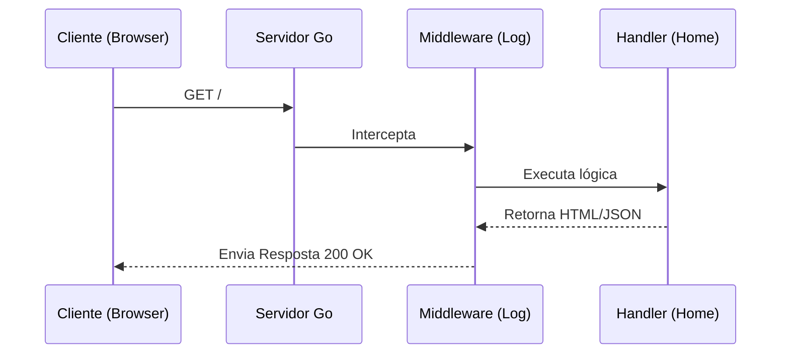

# Aula 09 - Programação Web com net/http 🌐

!!! tip "Objetivo"
    **Objetivo**: Aprender a criar servidores HTTP nativos em Go usando o pacote `net/http`, entender como funcionam os Handlers e como gerenciar rotas simples.

---

## 1. O Pacote net/http 📡

Go possui um servidor web de nível de produção embutido em sua biblioteca padrão. Diferente de outras linguagens que precisam de servidores externos (como Apache ou Nginx) para rodar a lógica, em Go o seu binário **é** o servidor.

### Criando um Servidor "Hello Web"
```go
package main

import (
    "fmt"
    "net/http"
)

func olaHandler(w http.ResponseWriter, r *http.Request) {
    fmt.Fprintf(w, "Olá, você acessou: %s", r.URL.Path)
}

func main() {
    http.HandleFunc("/", olaHandler) // Roteamento
    fmt.Println("Servidor rodando na porta 8080...")
    http.ListenAndServe(":8080", nil) // Inicia o servidor
}
```

---

## 2. Entendendo Handlers e Requests 🏗️

*   **http.ResponseWriter (`w`)**: É por onde você envia a resposta para o cliente (Status Code, Headers, Body).
*   **http.Request (`r`)**: Contém todas as informações da requisição vinda do cliente (Método, URL, Query Params, Body).

---

## 3. Servindo Arquivos Estáticos 📁

Go facilita muito o serviço de arquivos (HTML, CSS, Imagens).

```go
fs := http.FileServer(http.Dir("./static"))
http.Handle("/static/", http.StripPrefix("/static/", fs))
```

---

## 4. Middleware: O Interceptador 🛡️

Middlewares são funções que executam antes (ou depois) do seu handler principal. Úteis para logs, autenticação e métricas.

```go
func LogMiddleware(next http.HandlerFunc) http.HandlerFunc {
    return func(w http.ResponseWriter, r *http.Request) {
        fmt.Printf("Requisição: %s %s\n", r.Method, r.URL.Path)
        next(w, r)
    }
}
```

---

## 5. Ciclo de Vida da Requisição (Mermaid) 📊



---

## 6. Mini-Projeto: Contador de Visitas Web 🚀

Crie um servidor web que:
1.  Tenha uma variável global `contador`.
2.  Toda vez que a rota `/` for acessada, o contador incrementa.
3.  A resposta deve ser: "Você é o visitante número X".

---

## 7. Exercícios de Fixação 🧠

1.  Qual a função do `http.ListenAndServe`?
2.  Como você lê um parâmetro de busca (query param) em uma requisição?
3.  O que acontece se você tentar rodar o servidor em uma porta que já está sendo usada?

---

**Próxima Aula**: Vamos profissionalizar nossa comunicação com [APIs RESTful e Camadas](./aula-10.md)! 🏗️🐹
