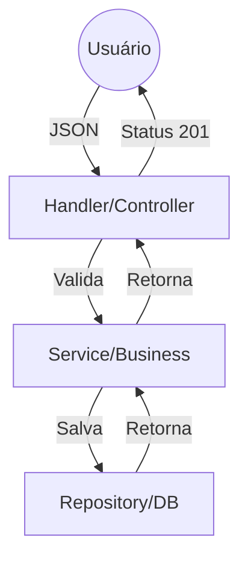

# Aula 10 - Construindo APIs REST 🏗️

!!! tip "Objetivo"
    **Objetivo**: Aplicar os conceitos de REST em Go, organizar o projeto em camadas (MVC adaptado) e entender o roteamento de recursos.

---

## 1. Organização em Camadas 🏛️

Para projetos reais, colocar tudo no `main.go` é inviável. Seguimos uma separação de responsabilidades:

*   **Handlers (Controller)**: Lida com a entrada HTTP e resposta.
*   **Services (Business Logic)**: Onde as regras de negócio vivem.
*   **Models (Data Objects)**: Define a estrutura dos dados.
*   **Repository (Data Access)**: Lida com o banco de dados.

---

## 2. Modelando nossa API de Produtos 📦

Vamos criar uma API para um catálogo:

```go
type Produto struct {
    ID    int     `json:"id"`
    Nome  string  `json:"nome"`
    Preco float64 `json:"preco"`
}

var produtos []Produto // Simulação de banco de dados
```

---

## 3. Implementando os Verbos HTTP 🎬

### Listar (GET)
```go
func ListarProdutos(w http.ResponseWriter, r *http.Request) {
    json.NewEncoder(w).Encode(produtos)
}
```

### Criar (POST)
```go
func CriarProduto(w http.ResponseWriter, r *http.Request) {
    var p Produto
    json.NewDecoder(r.Body).Decode(&p)
    produtos = append(produtos, p)
    w.WriteHeader(http.StatusCreated)
}
```

---

## 4. Estrutura de Pastas Profissional 📂

```termynal
$ tree
.
├── main.go
├── handlers/
│   └── product_handler.go
├── services/
│   └── product_service.go
├── models/
│   └── product.go
└── go.mod
```

---

## 5. Hierarquia de Chamadas (Mermaid) 📊



---

## 6. Mini-Projeto: API de Livros 🚀

Crie uma API básica que utilize `net/http` para:
1.  Listar livros.
2.  Adicionar um novo livro via POST.
3.  Organize o código em ao menos dois pacotes diferentes (ex: `main` e `models`).

---

## 7. Exercícios de Fixação 🧠

1.  Por que a separação por camadas é importante para testes automatizados?
2.  Como você retornaria um erro `404` se um produto não fosse encontrado?
3.  Qual a diferença entre `json.NewDecoder` e `json.Unmarshal` no contexto de uma requisição HTTP?

---

**Próxima Aula**: Vamos acelerar o desenvolvimento com o [Framework Gin](./aula-11.md)! 🚀🐹
