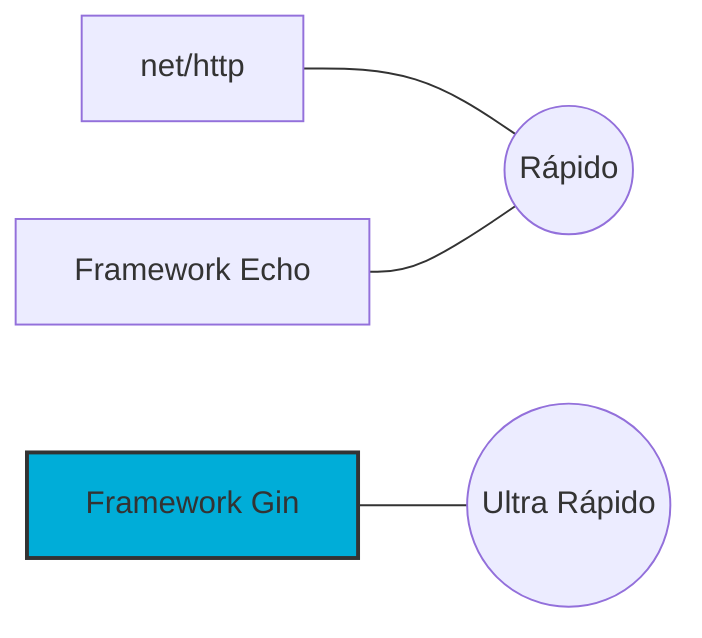

# Aula 11 - Framework Web Gin 🚀

!!! tip "Objetivo"
    **Objetivo**: Conhecer o framework Gin, suas vantagens sobre a biblioteca padrão, como gerenciar rotas complexas, parâmetros de URL e validação de dados.

---

## 1. Por que usar um Framework? 🤔

Embora o `net/http` seja excelente, ele é muito básico. Frameworks como o **Gin** fornecem funcionalidades prontas que economizam centenas de linhas de código:

*   **Velocidade**: Gin é um dos frameworks mais rápidos do ecossistema Go.
*   **Roteamento Avançado**: Suporte a parâmetros na URL (ex: `/user/:id`) e grupos de rotas.
*   **Middlewares**: Sistema de plugin simples e poderoso.
*   **Binding e Validação**: Converte JSON automaticamente para structs e valida os dados.

---

## 2. Primeiro Servidor com Gin 🍸

```go
package main

import "github.com/gin-gonic/gin"

func main() {
    r := gin.Default() // Cria uma instância com Logger e Recovery
    
    r.GET("/ping", func(c *gin.Context) {
        c.JSON(200, gin.H{
            "message": "pong",
        })
    })

    r.Run() // Inicia na porta 8080 por padrão
}
```

---

## 3. Parâmetros e Query String 📍

Gin torna a captura de dados externa muito simples através do `gin.Context`.

```go
// Parâmetro de URL: /usuario/ricardo
r.GET("/usuario/:nome", func(c *gin.Context) {
    nome := c.Param("nome")
    c.String(200, "Olá, %s", nome)
})

// Query String: /busca?q=golang
r.GET("/busca", func(c *gin.Context) {
    query := c.Query("q")
    c.JSON(200, gin.H{"resultado": query})
})
```

---

## 4. Binding e Validação de JSON 🏗️

Você pode usar tags `binding:"required"` para validar se um campo foi enviado.

```go
type Login struct {
    User     string `json:"user" binding:"required"`
    Password string `json:"password" binding:"required"`
}

r.POST("/login", func(c *gin.Context) {
    var json Login
    if err := c.ShouldBindJSON(&json); err != nil {
        c.JSON(400, gin.H{"error": err.Error()})
        return
    }
    c.JSON(200, gin.H{"status": "logado"})
})
```

---

## 5. Comparação de Performance (Mermaid) 📊



---

## 6. Mini-Projeto: API de Clientes com Gin 🚀

Utilizando o Gin, crie uma rota `POST /clientes` que:
1.  Receba um JSON com `nome`, `email` e `idade`.
2.  Valide se todos os campos estão presentes.
3.  Retorne o cliente criado com um ID gerado automaticamente.

---

## 7. Exercícios de Fixação 🧠

1.  Qual a principal diferença entre `r.GET` e `r.POST` no Gin?
2.  Para que serve o objeto `gin.H`?
3.  Como você agruparia todas as rotas de uma "v1" da sua API?

---

**Próxima Aula**: Vamos conectar tudo isso a um [Banco de Dados SQL com GORM](./aula-12.md)! 💾🐹