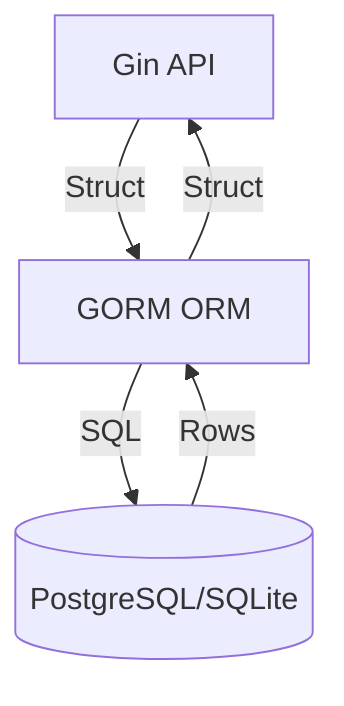

# Aula 12 - Banco de Dados (GORM) 💾

!!! tip "Objetivo"
    **Objetivo**: Aprender a conectar sua aplicação Go a um banco de dados relacional (PostgreSQL/SQLite) e realizar operações de CRUD usando o ORM GORM.

---

## 1. SQL Nativo vs ORM ⚖️

*   **database/sql**: A interface padrão do Go para SQL. Você escreve as queries manualmente. Mais controle, mais código.
*   **GORM**: O ORM (Object-Relational Mapping) mais popular para Go. Ele converte suas structs diretamente em tabelas e vice-versa. Menos código, mais produtividade.

---

## 2. Configurando o GORM e SQLite 🛠️

Para nossos testes, usaremos o SQLite (um banco de dados em arquivo), mas o código é quase idêntico para PostgreSQL.

```go
type Produto struct {
    gorm.Model // Adiciona ID, CreatedAt, UpdatedAt, DeletedAt
    Nome  string
    Preco float64
}

db, err := gorm.Open(sqlite.Open("test.db"), &gorm.Config{})
// Criar a tabela automaticamente (Migration)
db.AutoMigrate(&Produto{})
```

---

## 3. Operações de CRUD 📝

### Create (Criar)
```go
db.Create(&Produto{Nome: "Teclado", Preco: 200.0})
```

### Read (Ler)
```go
var produto Produto
db.First(&produto, 1) // Busca pelo ID 1
db.Find(&produtos)    // Busca todos
```

### Update (Atualizar)
```go
db.Model(&produto).Update("Preco", 250.0)
```

### Delete (Remover)
```go
db.Delete(&produto, 1)
```

---

## 4. Integração: API + Banco de Dados (Mermaid) 📊



---

## 5. Migrations: Evoluindo o Esquema 📈

O GORM cuida da criação e atualização das tabelas para você através do `AutoMigrate`. Se você adicionar um campo novo na Struct, o GORM cria a coluna no banco na próxima execução!

---

## 6. Mini-Projeto: API com Persistência Real 🚀

Modifique sua API de Clientes (da aula anterior) para que:
1.  Os dados não sejam mais salvos em um slice, mas sim no banco de dados via GORM.
2.  Ao iniciar a aplicação, as tabelas sejam criadas automaticamente.

---

## 7. Exercícios de Fixação 🧠

1.  O que a tag `gorm.Model` adiciona à sua struct?
2.  Como você faria uma busca filtrada (WHERE) usando GORM?
3.  Qual a vantagem de usar `AutoMigrate` em vez de criar tabelas manualmente no terminal SQL?

---

**Próxima Aula**: Vamos garantir que tudo funcione com [Testes Automatizados](./aula-13.md)! ✅🐹
