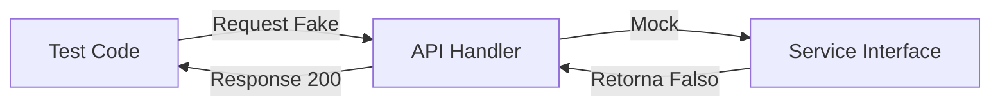

# Aula 13 - Testes em Go ✅

!!! tip "Objetivo"
    **Objetivo**: Compreender a importância dos testes automatizados, aprender a usar a ferramenta nativa `go test` e aplicar técnicas de TDD e Mocking.

---

## 1. Por que testar? 🧪

Testes automatizados garantem que seu código funciona como esperado e permitem que você faça refatorações com segurança. Em Go, o suporte a testes é **nativo** e integrado à linguagem.

---

## 2. Escrevendo seu Primeiro Teste 📝

Arquivos de teste em Go devem terminar obrigatoriamente com `_test.go`.

### Exemplo: `calculadora_test.go`
```go
package calculadora

import "testing"

func TestSoma(t *testing.T) {
    resultado := Soma(2, 3)
    esperado := 5

    if resultado != esperado {
        t.Errorf("Resultado incorreto: obtive %d, queria %d", resultado, esperado)
    }
}
```

Para rodar os testes, use o comando:
```termynal
$ go test -v
```

---

## 3. Testes de Tabela (Table-Driven Tests) 📊

Esta é a forma idiomática e profissional de escrever testes em Go, permitindo testar vários cenários em uma única função.

```go
func TestSomaMultipla(t *testing.T) {
    cenarios := []struct {
        a, b, esperado int
    }{
        {1, 1, 2},
        {10, 20, 30},
        {-1, 1, 0},
    }

    for _, c := range cenarios {
        res := Soma(c.a, c.b)
        if res != c.esperado {
            t.Errorf("Erro ao somar %d+%d: obtive %d", c.a, c.b, res)
        }
    }
}
```

---

## 4. Cobertura de Testes 📈

Go pode te dizer exatamente qual porcentagem do seu código está sendo testada.

```termynal
$ go test -cover
PASS
coverage: 85.0% of statements
ok      meu-projeto/calculadora 
```

---

## 5. Mocking em APIs 🎭

Ao testar handlers, não queremos chamar o banco de dados real. Usamos o pacote `httptest` para simular requisições HTTP.



---

## 6. Mini-Projeto: TDD na Prática 🚀

Utilizando TDD (Test Driven Development):
1.  Escreva primeiro um teste para uma função `InverterString(s string) string`.
2.  Rode o teste e veja-o falhar.
3.  Implemente a função até que o teste passe.

---

## 7. Exercícios de Fixação 🧠

1.  Qual o sufixo obrigatório de um arquivo de teste em Go?
2.  O que a flag `-v` faz no comando `go test`?
3.  Qual a vantagem dos Testes de Tabela em relação a testes individuais?

---

**Próxima Aula**: Vamos organizar o código como profissionais com [Clean Architecture](./aula-14.md)! 🏗️🐹