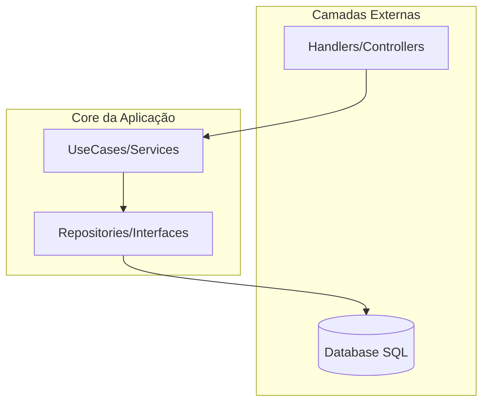

# Aula 14 - Arquitetura e Boas Práticas 🏗️

!!! tip "Objetivo"
    **Objetivo**: Entender os princípios da Clean Architecture, como aplicar Injeção de Dependência em Go e como organizar projetos de forma que sejam escaláveis e fáceis de manter.

---

## 1. Clean Architecture (Arquitetura Limpa) 🧊

A Clean Architecture foca na independência de frameworks, UI e banco de dados. O coração da aplicação é a **Lógica de Negócio (Entidades e Casos de Uso)**.

### As Camadas:
1.  **Entities/Models**: Regras de negócio globais.
2.  **Usecases/Services**: Lógica específica da aplicação.
3.  **Interfaces/Adapters**: Conecta o mundo externo (Handlers, Repositories).
4.  **Infrastructure**: Frameworks, Banco de Dados, Loggers.

---

## 2. Injeção de Dependência (DI) 💉

Em Go, aplicamos DI de forma manual e simples, geralmente via construtores que aceitam interfaces.

```go
type Service struct {
    repo RepositoryInterface
}

func NewService(r RepositoryInterface) *Service {
    return &Service{repo: r}
}
```

Isso permite que você troque o banco de dados real por um mock nos testes com facilidade.

---

## 3. Organização de Diretórios (Padrão Go) 📂

Um projeto profissional em Go costuma seguir esta estrutura:

```termynal
$ tree
.
├── cmd/             # Ponto de entrada (main.go)
├── internal/        # Código privado (Business Logic)
│   ├── entity/      
│   ├── service/     
│   └── repository/  
├── pkg/             # Código que pode ser importado por outros
└── api/             # Definições de API (Swagger/Proto)
```

---

## 4. O Fluxo de Controle (Mermaid) 📊



---

## 5. Boas Práticas (Cringe Free!) ✨

1.  **Nomeie pacotes com substantivos simples**: `user`, `auth`, `order` (evite `utils`, `helpers`).
2.  **Retorne structs, aceite interfaces**: Isso dá flexibilidade para quem consome seu código.
3.  **Mantenha o `main.go` magro**: Ele só deve "fiar" as dependências e iniciar o servidor.

---

## 6. Mini-Projeto: Refatorando para DI 🚀

Pegue sua API da Aula 12 e:
1.  Crie uma interface para o seu Repository.
2.  Altere o seu Service/Handler para receber essa interface no construtor.
3.  Verifique se o seu código continua funcionando após a refatoração.

---

## 7. Exercícios de Fixação 🧠

1.  Qual a principal vantagem da Clean Architecture?
2.  Por que usamos a pasta `internal` em Go?
3.  Como a Injeção de Dependência ajuda no desacoplamento do código?

---

**Próxima Aula**: Vamos colocar tudo no container com [Docker e preparar o Deploy](./aula-15.md)! 🐳🐹
