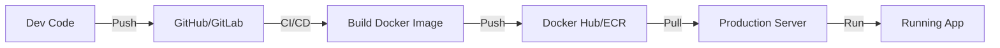

# Aula 15 - Docker e Deploy 🐳

!!! tip "Objetivo"
    **Objetivo**: Aprender a "conteinerizar" uma aplicação Go usando Docker, otimizando o tamanho da imagem com Multi-Stage Builds e preparando o ambiente para produção.

---

## 1. Por que usar Docker com Go? 🚀

Go gera binários estáticos, o que significa que eles não precisam de um runtime (como Python ou Node) instalado no servidor. O Docker ajuda a empacotar esse binário com suas dependências de sistema e arquivos estáticos, garantindo que o programa rode igual em qualquer lugar.

---

## 2. Multi-Stage Builds: O Segredo da Eficiência 🏗️

Como o Go só precisa do binário para rodar, não precisamos levar o compilador para a imagem final. Usamos dois estágios no `Dockerfile`:

```dockerfile
# Estágio 1: Compilação
FROM golang:1.21-alpine AS builder
WORKDIR /app
COPY . .
RUN go build -o main cmd/main.go

# Estágio 2: Execução (Imagem Final)
FROM alpine:latest
WORKDIR /app
COPY --from=builder /app/main .
CMD ["./main"]
```

Isso reduz uma imagem de **300MB+** para apenas **15MB**!

---

## 3. Docker Compose: Orquestrando Dependências 🎼

Se sua API precisa de um banco de dados, o `docker-compose.yml` facilita subir tudo junto.

```yaml
services:
  app:
    build: .
    ports: ["8080:8080"]
    depends_on: [db]
  db:
    image: postgres:alpine
    environment:
      POSTGRES_PASSWORD: 123
```

---

## 4. O Fluxo de Deploy (Mermaid) 📊



---

## 5. Variáveis de Ambiente e Configuração ⚙️

Nunca coloque senhas no código! Use variáveis de ambiente que o Go lê via `os.Getenv` e o Docker injeta.

---

## 6. Mini-Projeto: API no Container 🚀

Crie um `Dockerfile` para sua API de livros e:
1.  Gere a imagem via terminal.
2.  Suba um container mapeando a porta 8080.
3.  Acesse a API pelo navegador e verifique se ela responde corretamente.

---

## 7. Exercícios de Fixação 🧠

1.  Para que serve o "Multi-Stage Build" no Dockerfile?
2.  Qual a vantagem de usar imagens `alpine`?
3.  Como você passa uma variável de ambiente para um container Docker via linha de comando?

---

**Próxima Aula**: É hora de aplicar tudo no nosso [Projeto Final](./aula-16.md)! 🏆🐹