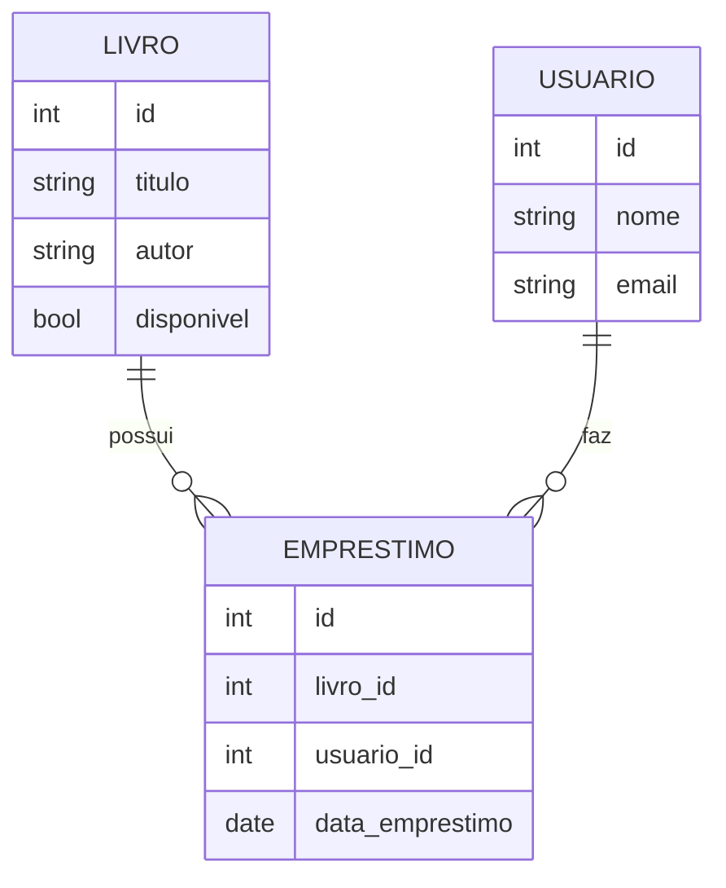

# Aula 16 - Projeto Final: Sistema de Gerenciamento de Biblioteca 🏆

!!! tip "Objetivo"
    **Objetivo**: Consolidar todos os conhecimentos adquiridos (Fundamentos, Web, Banco de Dados, Testes e Docker) através da construção de um projeto completo e profissional.

---

## 1. O Desafio 🚩

Você deve construir uma **API REST de Gerenciamento de Livros e Empréstimos**. O sistema deve permitir que usuários consultem livros, se cadastrem e realizem empréstimos.

### Requisitos Funcionais:
*   [x] Cadastro e Listagem de Livros.
*   [x] Cadastro de Usuários.
*   [x] Realização de Empréstimo (Verificando se o livro está disponível).
*   [x] Devolução de Livros.

---

## 2. Requisitos Técnicos (Obrigatórios) 🛠️

1.  **Linguagem**: Go (Golang).
2.  **Framework Web**: Gin Gonic.
3.  **Banco de Dados**: PostgreSQL (via GORM).
4.  **Arquitetura**: Clean Architecture (divida em camadas: Handler, Service, Repository, Entity).
5.  **Qualidade**: Ao menos 3 testes unitários significativos.
6.  **Infra**: Dockerfile e Docker Compose configurados.

---

## 3. Estrutura Sugerida do Projeto 📂

```termynal
/projeto-final
├── cmd/             # Main.go
├── internal/        # Camadas da Clean Arch
│   ├── handler/     # Gin Handlers
│   ├── service/     # Lógica de Empréstimo
│   ├── repository/  # GORM Repos
│   └── entity/      # Structs Models
├── scripts/         # SQL ou outros auxiliares
├── docker-compose.yml
└── Dockerfile
```

---

## 4. Diagrama da Entidade Relacional (Mermaid) 📊



---

## 5. Dicas para o Sucesso 💡

*   **Pense nos erros**: O que acontece se alguém tentar pegar um livro que já está emprestado?
*   **Use Middlewares**: Adicione um log simples para cada requisição.
*   **Documentação**: Um arquivo `README.md` bem escrito faz toda a diferença!

---

## 6. Conclusão da Jornada 🏁

Parabéns! Você completou o curso de **Programação em Go**. Você agora possui as ferramentas necessárias para construir sistemas robustos, rápidos e escaláveis no backend.

> [!IMPORTANT]
> O aprendizado não para aqui. Continue explorando a comunidade Go, leia o código fonte da biblioteca padrão e construa seus próprios projetos! 🐹🚀

---

**Próximo Passo**: Realize a entrega do seu projeto final e solicite seu feedback! 🎓🐹🏆🚀
