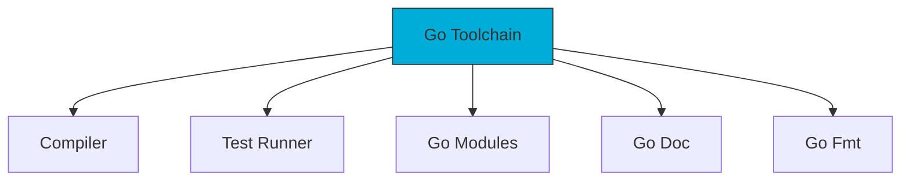

# Aula 01 - Introdução ao Go e Ecossistema 🐹
## A Linguagem do Google para a Nuvem

---

## Agenda de Hoje 📅

1. Origens e Filosofia do Go <!-- .element: class="fragment" -->
2. Diferenciais com outras linguagens <!-- .element: class="fragment" -->
3. Instalação e Setup <!-- .element: class="fragment" -->
4. O Arquivo go.mod <!-- .element: class="fragment" -->
5. "Hello World" na prática <!-- .element: class="fragment" -->
6. O Ecossistema e a Comunidade <!-- .element: class="fragment" -->

---

## 1. Por que o Go nasceu? 🐣

- Criado no **Google** (2007) por: <!-- .element: class="fragment" -->
    - *Robert Griesemer, Rob Pike e Ken Thompson*. <!-- .element: class="fragment" -->
- **Problemas reais**: <!-- .element: class="fragment" -->
    - Compilação lenta (C++). <!-- .element: class="fragment" -->
    - Dependências complexas. <!-- .element: class="fragment" -->
    - Dificuldade com multicore (concorrência). <!-- .element: class="fragment" -->

---

## 2. Filosofia: "Menos é Mais" 🧊

- Simplicidade acima de tudo. <!-- .element: class="fragment" -->
- Uma única forma de fazer as coisas. <!-- .element: class="fragment" -->
- Foco em **legibilidade** e **manutenibilidade**. <!-- .element: class="fragment" -->
- Binários estáticos e rápidos. <!-- .element: class="fragment" -->

---

## 3. Go vs Outras Linguagens 🥊

| Recurso | Go | Python | Java |
| :--- | :--- | :--- | :--- |
| Velocidade | ⚡ Alta | 🐢 Baixa | 🐎 Média |
| Tipagem | Estática | Dinâmica | Estática |
| Concorrência | Nativa | Complexa | Pesada |
| Binário | Único | Precisa Interpreter | Precisa JVM |

---

## 4. O Ecossistema Go 🐹



---

## 5. Setup do Ambiente 🚀

---

## Passo a Passo:

1. Baixar em [go.dev/dl](https://go.dev/dl). <!-- .element: class="fragment" -->
2. Extensão Go no **VS Code**. <!-- .element: class="fragment" -->
3. Verificar versão: `go version`. <!-- .element: class="fragment" -->

---

## 6. O Primeiro Programa 📝

```go
package main

import "fmt"

func main() {
    fmt.Println("Olá, Gopher! 🐹")
}
```

---

## 7. Módulos e Dependências 📂

- O arquivo `go.mod` é o coração do projeto. <!-- .element: class="fragment" -->
- Comando: `go mod init meu-projeto`. <!-- .element: class="fragment" -->
- Gerencia versões de bibliotecas externas de forma segura. <!-- .element: class="fragment" -->

---

## 8. Termynal na Prática 💻

```termynal
$ go mod init aula01
$ go run main.go
Olá, Gopher! 🐹
$ go build main.go
$ ./main
```

---

## Resumo da Aula ✅

- Go une a eficiência do C com a simplicidade do Python. <!-- .element: class="fragment" -->
- É a linguagem oficial da infraestrutura moderna (Docker, K8s). <!-- .element: class="fragment" -->
- Simplicidade gera produtividade em times grandes. <!-- .element: class="fragment" -->

---

## Próxima Aula: Fundamentos 🧱

- Variáveis e Tipos. <!-- .element: class="fragment" -->
- Controle de Fluxo. <!-- .element: class="fragment" -->
- Loops (o único `for`!). <!-- .element: class="fragment" -->

---

## Dúvidas? 🤔

> "O código deve ser escrito para que humanos o leiam, e apenas incidentalmente para que máquinas o executem."
