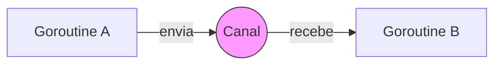

# Aula 08 - Concorrência em Go ⚡
## Desbloqueando a Alta Performance

---

## Agenda de Hoje 📅

1. Concorrência vs Paralelismo <!-- .element: class="fragment" -->
2. Goroutines: Threads Levíssimas <!-- .element: class="fragment" -->
3. Canais (Channels): Comunicação Segura <!-- .element: class="fragment" -->
4. O Poder do `select` <!-- .element: class="fragment" -->
5. Sincronização com WaitGroups <!-- .element: class="fragment" -->
6. Mini-Projeto: Web Crawler Básico <!-- .element: class="fragment" -->

---

## 1. Concorrência vs Paralelismo 🧩

- **Concorrência**: Gerenciar múltiplas tarefas (composição). <!-- .element: class="fragment" -->
- **Paralelismo**: Executar tarefas ao mesmo tempo (hardware). <!-- .element: class="fragment" -->
- "Go é mestre em lidar com milhares de conexões ao mesmo tempo." <!-- .element: class="fragment" -->

---

## 2. Goroutines 🪶

- Inicie uma tarefa em background com apenas a palavra `go`. <!-- .element: class="fragment" -->
- **Muito Leves**: 2KB de RAM inicial. <!-- .element: class="fragment" -->

```go
go processoLongo() // Executa sem travar o main
```

---

## 3. Canais (Channels) 📡

- Como as goroutines conversam? Através de "tubos". <!-- .element: class="fragment" -->

```go
canal := make(chan string)

go func() {
    canal <- "Feito!" // Envia
}()

msg := <-canal // Bloqueia até receber
```

---

## 4. CSP: A Filosofia do Go 🧐

> "Não comunique compartilhando memória; compartilhe memória comunicando." <!-- .element: class="fragment" -->

- Evita Race Conditions (condições de corrida). <!-- .element: class="fragment" -->
- Código mais limpo e seguro. <!-- .element: class="fragment" -->

---

## 5. Visualização de Canais 📊



---

## 6. Sincronização: WaitGroups 🛑

- Como o `main` sabe que as goroutines terminaram? <!-- .element: class="fragment" -->

```go
var wg sync.WaitGroup
wg.Add(1)
go func() {
    defer wg.Done()
    // Trabalho...
}()
wg.Wait() // Espera o trabalho acabar
```

---

## Resumo da Aula ✅

- Goroutines permitem escala massiva com pouco recurso. <!-- .element: class="fragment" -->
- Canais garantem que os dados troquem de mãos com segurança. <!-- .element: class="fragment" -->
- Go foi pensada para o mundo multicore moderno. <!-- .element: class="fragment" -->

---

## Próxima Aula: Programação Web 🌐

- Iniciando o Backend Real. <!-- .element: class="fragment" -->
- O pacote `net/http`. <!-- .element: class="fragment" -->

---

## Dúvidas? 🤔

> "O paralelismo é sobre execução, a concorrência é sobre estrutura."