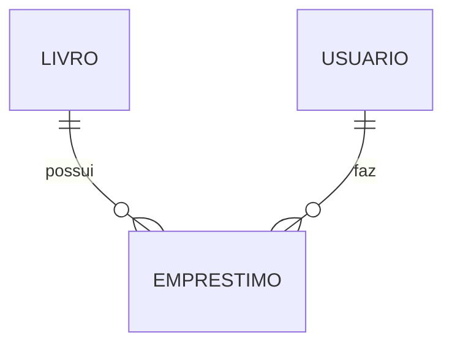

# Aula 16 - Projeto Final: Sistema de Biblioteca 🏆
## Consolidando o Conhecimento do Gopher

---

## O Desafio Final 🚩

- Construir uma **API de Gerenciamento de Biblioteca**. <!-- .element: class="fragment" -->
- **Funcionalidades**: <!-- .element: class="fragment" -->
    - CRUD de Livros e Usuários. <!-- .element: class="fragment" -->
    - Lógica de Empréstimo (Disponibilidade). <!-- .element: class="fragment" -->
    - Relatórios Simples. <!-- .element: class="fragment" -->

---

## Requisitos Técnicos 🛠️

- Framework **Gin**. <!-- .element: class="fragment" -->
- Banco **PostgreSQL** (GORM). <!-- .element: class="fragment" -->
- **Clean Architecture** (Camadas). <!-- .element: class="fragment" -->
- **Docker** & **Docker Compose**. <!-- .element: class="fragment" -->
- **Testes Unitários**. <!-- .element: class="fragment" -->

---

## Estrutura de Domínio 📊

---

## Dicas para o Sucesso 💡

- Comece pelas **Entities**. <!-- .element: class="fragment" -->
- Implemente o **Repository** e teste o banco. <!-- .element: class="fragment" -->
- Crie o **Service** com a regra de empréstimo. <!-- .element: class="fragment" -->
- Finalize com os **Handlers** e as rotas. <!-- .element: class="fragment" -->

---

## Avaliação de Qualidade ✅

- Código limpo (Go Fmt). <!-- .element: class="fragment" -->
- Sem variáveis globais. <!-- .element: class="fragment" -->
- Tratamento correto de erros (`err != nil`). <!-- .element: class="fragment" -->

---

## Conclusão da Jornada 🏁

- Você dominou o básico e o intermediário do Go. <!-- .element: class="fragment" -->
- Está apto a criar microserviços escaláveis. <!-- .element: class="fragment" -->
- Bem-vindo à comunidade Gopher! 🐹🚀 <!-- .element: class="fragment" -->

---

## Próximos Passos 🚀

- Explore Generics (Go 1.18+).
- Estude Microsserviços com gRPC.
- Contribua com projetos Open Source.

---

## Parabéns! 🎓🏆

> "O fim de um curso é apenas o começo de uma carreira."