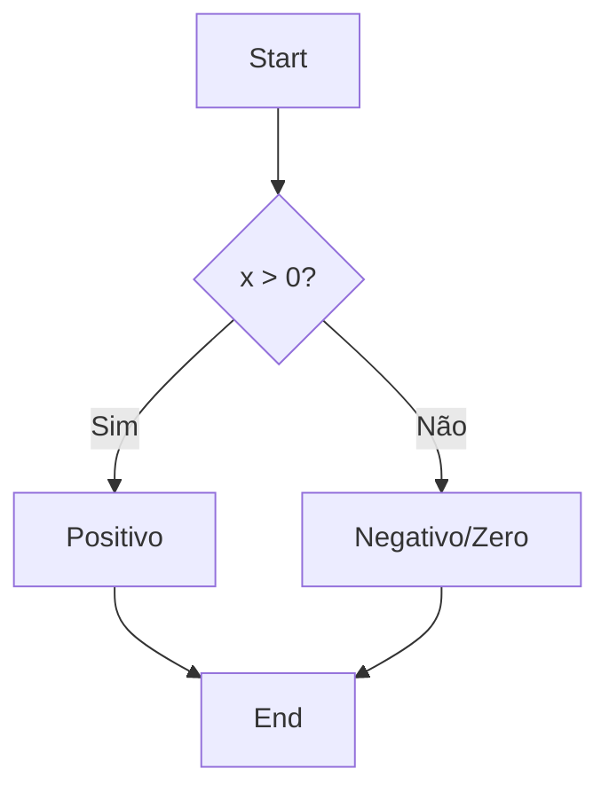

# Aula 02 - Fundamentos da Linguagem 🧱
## Variáveis, Tipos e Controle de Fluxo

---

## Agenda de Hoje 📅

1. Variáveis e Declaração Curta { .fragment }
2. Tipos de Dados Primitivos { .fragment }
3. Constantes e Iota { .fragment }
4. Estruturas Condicionais (If/Switch) { .fragment }
5. Repetição: O Poder do For { .fragment }
6. Mini-Projeto: Calculadora IMC { .fragment }

---

## 1. Declarando Variáveis 📦

- **Forma Explícita**: `var nome string = "Gopher"` { .fragment }
- **Forma Curta**: `idade := 25` { .fragment }
- **Zero Values**: Int (0), String (""), Bool (false). { .fragment }

---

## 2. Tipos Primitivos 💎

- Inteiros: `int`, `int64`, `uint`. { .fragment }
- Decimais: `float32`, `float64`. { .fragment }
- Booleano: `bool`. { .fragment }
- Texto: `string` (Imutável). { .fragment }

> [!WARNING]
> Go não converte tipos automaticamente! `int + float64` causa erro.

---

## 3. Controle de Fluxo: If/Else 🚦

- Não usa parênteses. { .fragment }
- Chaves `{}` são obrigatórias. { .fragment }

```go
if idade >= 18 {
    fmt.Println("Adulto")
} else {
    fmt.Println("Menor")
}
```

---

## 4. O Switch "Inteligente" 💡

- Não precisa de `break`. { .fragment }
- Pode avaliar condições complexas. { .fragment }

```go
switch {
case nota >= 7:
    fmt.Println("Aprovado")
case nota >= 5:
    fmt.Println("Recuperação")
default:
    fmt.Println("Reprovado")
}
```

---

## 5. Estruturas de Repetição 🔁

- **O Único Loop**: `for`. { .fragment }

```go
// Estilo C
for i := 0; i < 5; i++ { ... }

// Estilo While
for x < 10 { ... }

// Infinito
for { ... }
```

---

## 6. Diagrama de Fluxo 📊



---

## 7. Mini-Projeto: Calculadora IMC 🚀

```go
func main() {
    peso := 70.0
    altura := 1.75
    imc := peso / (altura * altura)
    fmt.Printf("Seu IMC é: %.2f\n", imc)
}
```

---

## Resumo da Aula ✅

- Go é estaticamente tipado e seguro. { .fragment }
- Controle de fluxo simples e direto. { .fragment }
- O `for` é a ferramenta universal de repetição. { .fragment }

---

## Próxima Aula: Funções e Organização 🧩

- Múltiplos retornos. { .fragment }
- Ponteiros (sem medo!). { .fragment }
- Pacotes e Módulos. { .fragment }
