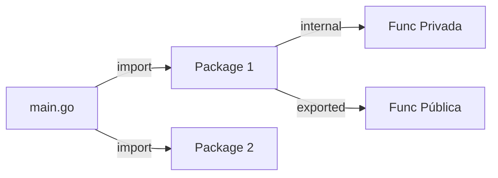

# Aula 03 - Funções e Organização do Código 🧩
## Estruturando Projetos de Forma Profissional

---

## Agenda de Hoje 📅

1. Anatomia de uma Função { .fragment }
2. Retornos Múltiplos e Variádicos { .fragment }
3. Ponteiros: Endereços vs Valores { .fragment }
4. Visibilidade (Exportação) { .fragment }
5. Módulos e Gestão de Pacotes { .fragment }
6. Mini-Projeto: Conversos Modular { .fragment }

---

## 1. Funções em Go ⚙️

- Funções são blocos independentes. { .fragment }
- **Cidadãs de 1ª Classe**: Podem ser variáveis e argumentos. { .fragment }

```go
func somar(a int, b int) int {
    return a + b
}
```

---

## 2. O Diferencial: Retornos Múltiplos 🔄

- Útil para retornar o dado e o erro simultaneamente. { .fragment }

```go
func dividir(a, b float64) (float64, error) {
    if b == 0 {
        return 0, errors.New("não pode dividir por 0")
    }
    return a / b, nil
}
```

---

## 3. Ponteiros: O Guia Definitivo 📍

- **Endereço (`&`)**: Onde o dado mora. { .fragment }
- **Valor (`*`)**: O que tem dentro da casa. { .fragment }

```go
func dobrar(n *int) {
    *n = *n * 2
}
```

> "Ponteiros economizam memória ao evitar cópias de objetos grandes." { .fragment }

---

## 4. Organizando a Casa: Pacotes 📂

- Pastas = Pacotes. { .fragment }
- **Exportação Camuflada**: { .fragment }
    - `Calcular` (Maiúsculo) -> Público. { .fragment }
    - `calcular` (Minúsculo) -> Privado do pacote. { .fragment }

---

## 5. Estrutura de Projeto 🏗️

```termynal
$ tree
.
├── go.mod
├── main.go
└── conversor/
    └── temperatura.go
```

---

## 6. Diagrama de Módulo 📊



---

## Resumo da Aula ✅

- Go força uma organização clara por pastas. { .fragment }
- Múltiplos retornos eliminam a necessidade de exceções globais. { .fragment }
- Ponteiros dão controle total sobre a performance. { .fragment }

---

## Próxima Aula: Estruturas de Dados 🗄️

- Slices: Arrays dinâmicos. { .fragment }
- Maps: O dicionário do Go. { .fragment }
- Structs: Criando seus tipos. { .fragment }

---

## Dúvidas? 🤔

> "Um código bom é um código organizado."