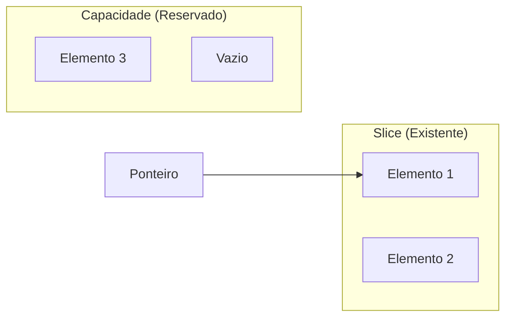

# Aula 04 - Estruturas de Dados Avançadas 🗄️
## Gerenciando Coleções e Tipos Customizados

---

## Agenda de Hoje 📅

1. Arrays vs Slices { .fragment }
2. Manipulação de Slices (Append/Slice) { .fragment }
3. Maps: Chave e Valor { .fragment }
4. Structs: O Coração dos Dados { .fragment }
5. Métodos e Comportamento { .fragment }
6. Mini-Projeto: Escola de Gophers { .fragment }

---

## 1. Arrays vs Slices 🍕

- **Arrays**: Rígidos, tamanho faz parte do tipo. { .fragment }
- **Slices**: Flexíveis, dinâmicos. O "padrão" do Go. { .fragment }

```go
// Array
var a [2]string

// Slice
s := []string{"A", "B"}
s = append(s, "C")
```

---

## 2. Anatomia de um Slice 🔍



---

## 3. Maps: O Dicionário Veloz 🗝️

- Coleção de pares chave-valor. { .fragment }
- Chaves devem ser comparáveis. { .fragment }

```go
estoque := make(map[string]int)
estoque["teclado"] = 50

valor, existe := estoque["mouse"]
```

---

## 4. Structs: Seus Próprios Tipos 🏗️

- Go não tem classes, tem Structs. { .fragment }
- Agrupam dados de tipos diferentes. { .fragment }

```go
type Aluno struct {
    Nome  string
    Idade int
    Notas []float64
}
```

---

## 5. Adicionando Comportamento (Métodos) ⚡

- Funções "anexadas" a um tipo. { .fragment }

```go
func (a Aluno) Media() float64 {
    total := 0.0
    for _, n := range a.Notas {
        total += n
    }
    return total / float64(len(a.Notas))
}
```

---

## 6. Mini-Projeto: Escola de Gophers 🚀

- Criar um sistema que armazena alunos em um `map`. { .fragment }
- Cada aluno é uma `struct`. { .fragment }
- Calcular e exibir médias. { .fragment }

---

## Resumo da Aula ✅

- Slices são extensões dinâmicas de memória. { .fragment }
- Maps oferecem performance em buscas por chaves. { .fragment }
- Structs modelam o domínio do seu negócio. { .fragment }

---

## Próxima Aula: Interfaces e Flexibilidade 🧩

- O segredo do Polimorfismo em Go. { .fragment }
- Programação baseada em Composição. { .fragment }

---

## Dúvidas? 🤔

> "A estrutura de dados correta resolve metade do problema."
