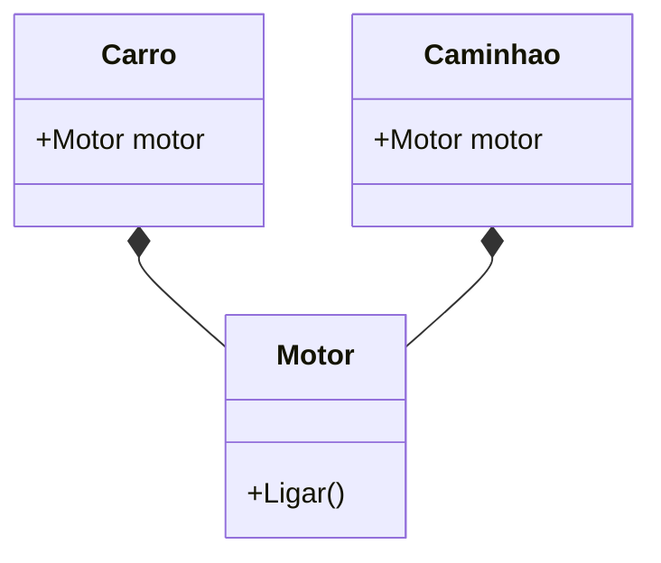

# Aula 05 - Interfaces e Composição 🧩
## O Segredo da Flexibilidade em Go

---

## Agenda de Hoje 📅

1. O Conceito de Interfaces { .fragment }
2. Implementação Implícita (Duck Typing) { .fragment }
3. Polimorfismo na Prática { .fragment }
4. Composição vs Herança { .fragment }
5. Embedding de Structs { .fragment }
6. Mini-Projeto: Sistema de Pagamentos { .fragment }

---

## 1. O que são Interfaces? 🔌

- Define **O Que** um objeto faz, não **Como**. { .fragment }
- É um conjunto de assinaturas de métodos. { .fragment }

```go
type Documento interface {
    Imprimir() string
}
```

---

## 2. Duck Typing em Go 🦆

> "Se caminha como pato e faz quack como pato..." { .fragment }

- Não existe a palavra `implements`. { .fragment }
- Se você tem os métodos, você **é** o tipo. { .fragment }

---

## 3. Polimorfismo 🎭

```go
func ExecutarImpressao(d Documento) {
    fmt.Println(d.Imprimir())
}

// Aceita PDF, Docx, TXT... qualquer um que "Imprima".
```

---

## 4. Composição (O Diferencial) 🏗️

- Go não tem herança (`class A extends B`). { .fragment }
- Usamos **Embedding** para reutilizar comportamento. { .fragment }

---

## 5. Exemplo de Composição 🚲

```go
type Motor struct { ... }

type Carro struct {
    Motor // Carro "tem um" motor
    Marca string
}
```

---

## 6. Diagrama de Composição 📊



---

## 7. A Interface Vazia: `any` ☁️

- `interface{}` aceita qualquer valor. { .fragment }
- Útil para funções genéricas (ex: `fmt.Println`). { .fragment }
- **Cuidado**: Perde a segurança de tipos! { .fragment }

---

## Resumo da Aula ✅

- Interfaces focam em **comportamento**. { .fragment }
- Composição é mais simples e flexível que herança. { .fragment }
- "Aceite interfaces, retorne structs". { .fragment }

---

## Próxima Aula: Tratamento de Erros ⚠️

- Por que não temos `try/catch`? { .fragment }
- O valor `error`. { .fragment }
- Panic e Recover. { .fragment }

---

## Dúvidas? 🤔

> "Dê-me uma interface e eu moverei o mundo."
