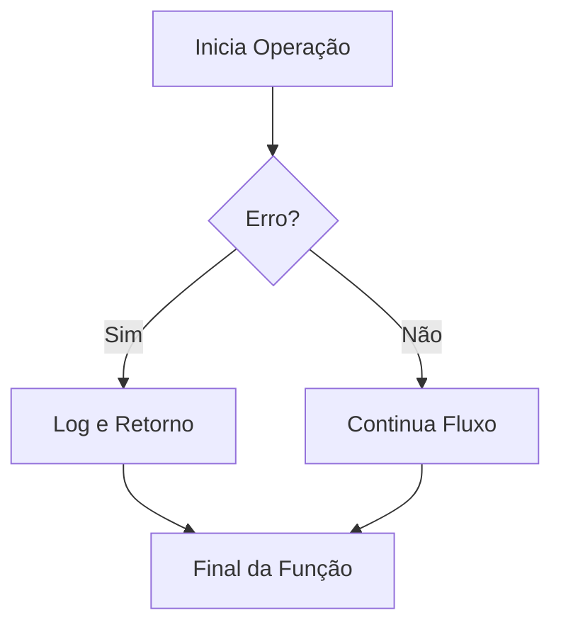

# Aula 06 - Tratamento de Erros ⚠️
## Lidando com Falhas de Forma Idiomática

---

## Agenda de Hoje 📅

1. Filosofia: Erros como Valores { .fragment }
2. O Padrão `if err != nil` { .fragment }
3. Erros Customizados { .fragment }
4. O Poder do `defer` { .fragment }
5. Panic e Recover { .fragment }
6. Mini-Projeto: Validador de Senha { .fragment }

---

## 1. Por que não Try/Catch? 🚫

- Exceções criam fluxos de controle ocultos ("saltos mágicos"). { .fragment }
- Go prefere o tratamento explícito: **"Lide com o erro onde ele ocorre"**. { .fragment }
- Erros são retornos, não interrupções catastróficas. { .fragment }

---

## 2. O Padrão Ouro do Go 🏆

```go
f, err := os.Open("arquivo.txt")
if err != nil {
    return fmt.Errorf("falha ao abrir: %w", err)
}
defer f.Close()
```

- Simples, legível e previsível. { .fragment }

---

## 3. Defer: Adiar para Garantir ⏱️

- Executa no final da função, não importa o que aconteça. { .fragment }
- Ideal para limpeza de recursos (Clean-up). { .fragment }

```go
mu.Lock()
defer mu.Unlock() // Destrava no final, aconteça o que acontecer
```

---

## 4. Diferença Crucial ⚖️

| Erro (Common) | Panic (Fatal) |
| :--- | :--- |
| Validação de dados | Falta de memória |
| Arquivo não encontrado | Erro lógico impossível |
| Timeout de rede | Corrupção de estado |

---

## 5. Fluxo de Tratamento 📊



---

## 6. Mini-Projeto: Validador de Senha 🚀

- Função `Validar(senha string) error`. { .fragment }
- Retorna erros específicos para: { .fragment }
    - Senha curta. { .fragment }
    - Sem números. { .fragment }

---

## Resumo da Aula ✅

- Erros são valores e devem ser verificados. { .fragment }
- O `defer` é seu melhor amigo para evitar vazamento de recursos. { .fragment }
- Reserve o `panic` para o que é realmente fatal. { .fragment }

---

## Próxima Aula: Arquivos e JSON 📁

- Lendo e escrevendo no disco. { .fragment }
- Serialização com Struct Tags. { .fragment }

---

## Dúvidas? 🤔

> "Não apenas trate o erro, dê contexto a ele."
