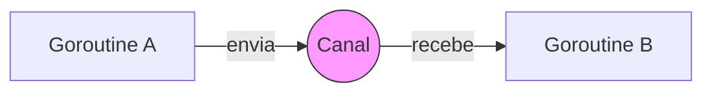

# Aula 08 - Concorrência em Go ⚡
## Desbloqueando a Alta Performance

---

## Agenda de Hoje 📅

1. Concorrência vs Paralelismo { .fragment }
2. Goroutines: Threads Levíssimas { .fragment }
3. Canais (Channels): Comunicação Segura { .fragment }
4. O Poder do `select` { .fragment }
5. Sincronização com WaitGroups { .fragment }
6. Mini-Projeto: Web Crawler Básico { .fragment }

---

## 1. Concorrência vs Paralelismo 🧩

- **Concorrência**: Gerenciar múltiplas tarefas (composição). { .fragment }
- **Paralelismo**: Executar tarefas ao mesmo tempo (hardware). { .fragment }
- "Go é mestre em lidar com milhares de conexões ao mesmo tempo." { .fragment }

---

## 2. Goroutines 🪶

- Inicie uma tarefa em background com apenas a palavra `go`. { .fragment }
- **Muito Leves**: 2KB de RAM inicial. { .fragment }

```go
go processoLongo() // Executa sem travar o main
```

---

## 3. Canais (Channels) 📡

- Como as goroutines conversam? Através de "tubos". { .fragment }

```go
canal := make(chan string)

go func() {
    canal <- "Feito!" // Envia
}()

msg := <-canal // Bloqueia até receber
```

---

## 4. CSP: A Filosofia do Go 🧐

> "Não comunique compartilhando memória; compartilhe memória comunicando." { .fragment }

- Evita Race Conditions (condições de corrida). { .fragment }
- Código mais limpo e seguro. { .fragment }

---

## 5. Visualização de Canais 📊



---

## 6. Sincronização: WaitGroups 🛑

- Como o `main` sabe que as goroutines terminaram? { .fragment }

```go
var wg sync.WaitGroup
wg.Add(1)
go func() {
    defer wg.Done()
    // Trabalho...
}()
wg.Wait() // Espera o trabalho acabar
```

---

## Resumo da Aula ✅

- Goroutines permitem escala massiva com pouco recurso. { .fragment }
- Canais garantem que os dados troquem de mãos com segurança. { .fragment }
- Go foi pensada para o mundo multicore moderno. { .fragment }

---

## Próxima Aula: Programação Web 🌐

- Iniciando o Backend Real. { .fragment }
- O pacote `net/http`. { .fragment }

---

## Dúvidas? 🤔

> "O paralelismo é sobre execução, a concorrência é sobre estrutura."