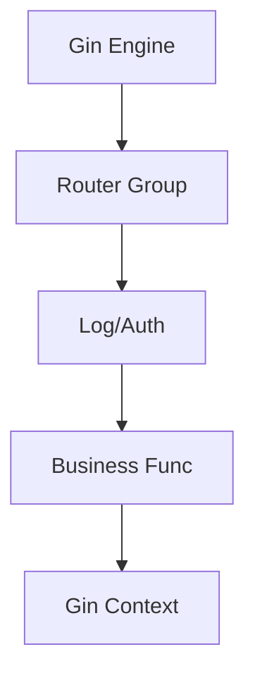

# Aula 11 - Framework Web Gin 🚀
## Acelerando o Desenvolvimento Backend

---

## Agenda de Hoje 📅

1. Por que usar Frameworks? { .fragment }
2. Introdução ao Gin Gonic { .fragment }
3. Roteamento e Parâmetros { .fragment }
4. JSON Binding e Validação { .fragment }
5. Grupos de Rotas e Organização { .fragment }
6. Mini-Projeto: API de Clientes { .fragment }

---

## 1. Gin: O Motor de Performance 🏍️

- Um dos frameworks mais rápidos do mundo Go. { .fragment }
- Sintaxe amigável (estilo Martini/Sinatra). { .fragment }
- **Gopher Friendly**: Foca na produtividade. { .fragment }

```go
r := gin.Default()
r.Run()
```

---

## 2. O Contexto do Gin 📦

- `c *gin.Context` é o seu canivete suíço. { .fragment }
- Captura Params, Query, Body e Response. { .fragment }

```go
id := c.Param("id")
status := c.Query("status")
```

---

## 3. Roteamento Limpo 📍

```go
v1 := r.Group("/v1")
{
    v1.POST("/login", loginHandler)
    v1.GET("/perfil", perfilHandler)
}
```

- Aplique Middlewares apenas em grupos específicos. { .fragment }

---

## 4. Validação Inteligente 🛡️

- Use as Struct Tags a seu favor. { .fragment }

```go
type User struct {
    Email string `json:"email" binding:"required,email"`
    Idade int    `json:"idade" binding:"gte=18"`
}
```

- Gin valida e retorna erro 400 automaticamente. { .fragment }

---

## 5. Hierarquia Gin 📊



---

## 6. Mini-Projeto: API de Clientes 🚀

- Criar rota `POST /clientes`. { .fragment }
- Validar entrada de e-mail. { .fragment }
- Retornar JSON com sucesso ou erro detalhado. { .fragment }

---

## Resumo da Aula ✅

- Gin automatiza as tarefas chatas (binding, roteamento). { .fragment }
- Grupos de rotas mantêm o projeto organizado. { .fragment }
- Validação via Tags evita código boilerplate de `if`. { .fragment }

---

## Próxima Aula: Banco de Dados com GORM 💾

- Persistência real.
- Migrations Automáticas.

---

## Dúvidas? 🤔

> "Não reinvente a roda, use um motor potente. Use Gin."