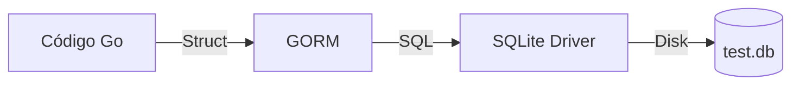

# Aula 12 - Banco de Dados (GORM) 💾
## Persistência de Dados Profissional em Go

---

## Agenda de Hoje 📅

1. SQL Puro vs ORM { .fragment }
2. Introdução ao GORM { .fragment }
3. Models e Auto-Migrations { .fragment }
4. Operações de CRUD { .fragment }
5. Relacionamentos (Has One, Has Many) { .fragment }
6. Mini-Projeto: API com Banco Real { .fragment }

---

## 1. O que é um ORM? 🗺️

- **Object-Relational Mapping**. { .fragment }
- Traduz Tabelas ↔ Structs. { .fragment }
- Abstrai o SQL para funções Go. { .fragment }

---

## 2. Definindo Modelos 🏗️

```go
type Produto struct {
    gorm.Model // ID, Created, Updated, Deleted
    Nome  string `gorm:"size:100;not null"`
    Preco float64
}
```

- Tags controlam o comportamento do SQL. { .fragment }

---

## 3. Auto-Migrations 📈

- Não escreva `CREATE TABLE` manual! { .fragment }

```go
db.AutoMigrate(&Produto{})
```

- O GORM sincroniza seu código com o banco. { .fragment }

---

## 4. O Ciclo do CRUD 📝

- **Create**: `db.Create(&p)`. { .fragment }
- **Read**: `db.First(&p, 1)` ou `db.Find(&lista)`. { .fragment }
- **Update**: `db.Model(&p).Update("Preco", 100)`. { .fragment }
- **Delete**: `db.Delete(&p)`. { .fragment }

---

## 5. Arquitetura DB 📊



---

## 6. Mini-Projeto: API Persistente 🚀

- Integrar Gin + GORM. { .fragment }
- Salvar dados enviados pelo Postman no SQLite. { .fragment }
- Garantir que dados existam após reiniciar. { .fragment }

---

## Resumo da Aula ✅

- GORM traz velocidade e segurança ao lidar com SQL. { .fragment }
- `gorm.Model` padroniza seus registros. { .fragment }
- Migrations automáticas eliminam erros de script manuais. { .fragment }

---

## Próxima Aula: Testes em Go ✅

- Garantindo que a API não quebre.
- Testes Unitários e Table-Driven.

---

## Dúvidas? 🤔

> "Quem não persiste, não existe. No banco de dados e na vida."