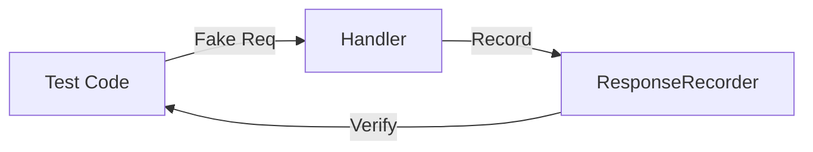

# Aula 13 - Testes em Go ✅
## Garantindo a Qualidade e Estabilidade do seu Código

---

## Agenda de Hoje 📅

1. Por que testar é vital? { .fragment }
2. O comando `go test` { .fragment }
3. Testes Unitários Básicos { .fragment }
4. Table-Driven Tests (Idiomático) { .fragment }
5. Cobertura e Performance { .fragment }
6. Mini-Projeto: TDD na Prática { .fragment }

---

## 1. O Suporte Nativo 🧪

- Go não precisa de frameworks externos (como Jest ou JUnit). { .fragment }
- Pacote `testing` e comando `go test` fazem tudo. { .fragment }
- Sufixo obrigatório: `_test.go`. { .fragment }

---

## 2. Testes de Tabela (Professional) 📊

- Teste múltiplos cenários com um único loop. { .fragment }

```go
tests := []struct {
    a, b, want int
}{
    {1, 1, 2},
    {2, 2, 4},
    {-1, 1, 0},
}
```

---

## 3. Cobertura de Testes 📈

- Quanto do seu código está realmente protegido? { .fragment }

```termynal
$ go test -cover
coverage: 87.5%
```

- Gere relatórios HTML visuais para análise. { .fragment }

---

## 4. Mocking de API 🎭

- Teste Handlers sem subir o servidor. { .fragment }
- Pacote `net/http/httptest`. { .fragment }



---

## 5. Benchmarks: Medindo Velocidade ⚡

- Teste o tempo de execução e alocação de memória. { .fragment }

```go
func BenchmarkProcesso(b *testing.B) {
    for i := 0; i < b.N; i++ {
        Processo()
    }
}
```

---

## 6. Mini-Projeto: TDD na Prática 🚀

- Inverter uma string. { .fragment }
- Passo 1: Criar o teste (FAIL). { .fragment }
- Passo 2: Codar a função. { .fragment }
- Passo 3: Testar novamente (PASS). { .fragment }

---

## Resumo da Aula ✅

- Testes em Go são simples e rápidos. { .fragment }
- Table-driven tests evitam duplicação de lógica. { .fragment }
- Cobertura alta = Dormir tranquilo. { .fragment }

---

## Próxima Aula: Arquitetura Limpa 🏗️

- Injeção de Dependência.
- Organizando grandes projetos.

---

## Dúvidas? 🤔

> "Testes não evitam bugs, eles evitam que os mesmos bugs voltem."
