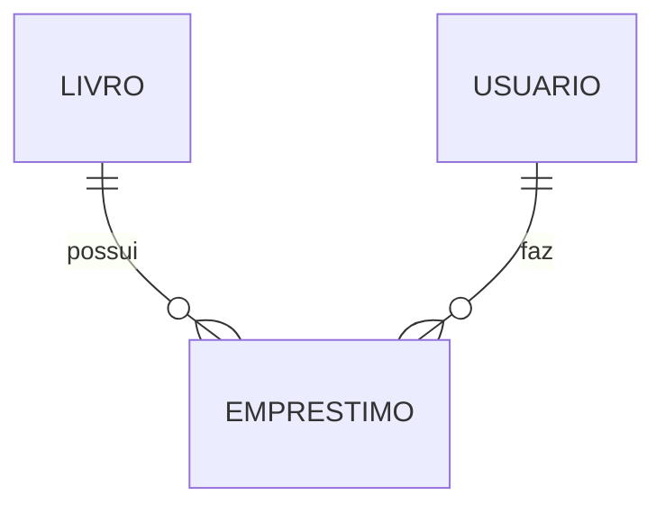

# Aula 16 - Projeto Final: Sistema de Biblioteca 🏆
## Consolidando o Conhecimento do Gopher

---

## O Desafio Final 🚩

- Construir uma **API de Gerenciamento de Biblioteca**. { .fragment }
- **Funcionalidades**: { .fragment }
    - CRUD de Livros e Usuários. { .fragment }
    - Lógica de Empréstimo (Disponibilidade). { .fragment }
    - Relatórios Simples. { .fragment }

---

## Requisitos Técnicos 🛠️

- Framework **Gin**. { .fragment }
- Banco **PostgreSQL** (GORM). { .fragment }
- **Clean Architecture** (Camadas). { .fragment }
- **Docker** & **Docker Compose**. { .fragment }
- **Testes Unitários**. { .fragment }

---

## Estrutura de Domínio 📊

---

## Dicas para o Sucesso 💡

- Comece pelas **Entities**. { .fragment }
- Implemente o **Repository** e teste o banco. { .fragment }
- Crie o **Service** com a regra de empréstimo. { .fragment }
- Finalize com os **Handlers** e as rotas. { .fragment }

---

## Avaliação de Qualidade ✅

- Código limpo (Go Fmt). { .fragment }
- Sem variáveis globais. { .fragment }
- Tratamento correto de erros (`err != nil`). { .fragment }

---

## Conclusão da Jornada 🏁

- Você dominou o básico e o intermediário do Go. { .fragment }
- Está apto a criar microserviços escaláveis. { .fragment }
- Bem-vindo à comunidade Gopher! 🐹🚀 { .fragment }

---

## Próximos Passos 🚀

- Explore Generics (Go 1.18+).
- Estude Microsserviços com gRPC.
- Contribua com projetos Open Source.

---

## Parabéns! 🎓🏆

> "O fim de um curso é apenas o começo de uma carreira."