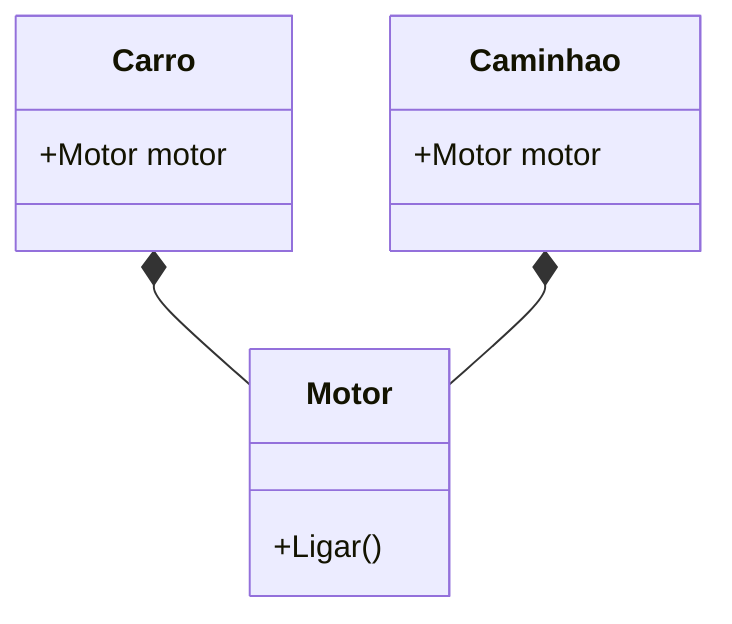

# Aula 05 - Interfaces e Composição 🧩
## O Segredo da Flexibilidade em Go

---

## Agenda de Hoje 📅

1. O Conceito de Interfaces <!-- .element: class="fragment" -->
2. Implementação Implícita (Duck Typing) <!-- .element: class="fragment" -->
3. Polimorfismo na Prática <!-- .element: class="fragment" -->
4. Composição vs Herança <!-- .element: class="fragment" -->
5. Embedding de Structs <!-- .element: class="fragment" -->
6. Mini-Projeto: Sistema de Pagamentos <!-- .element: class="fragment" -->

---

## 1. O que são Interfaces? 🔌

- Define **O Que** um objeto faz, não **Como**. <!-- .element: class="fragment" -->
- É um conjunto de assinaturas de métodos. <!-- .element: class="fragment" -->

```go
type Documento interface {
    Imprimir() string
}
```

---

## 2. Duck Typing em Go 🦆

> "Se caminha como pato e faz quack como pato..." <!-- .element: class="fragment" -->

- Não existe a palavra `implements`. <!-- .element: class="fragment" -->
- Se você tem os métodos, você **é** o tipo. <!-- .element: class="fragment" -->

---

## 3. Polimorfismo 🎭

```go
func ExecutarImpressao(d Documento) {
    fmt.Println(d.Imprimir())
}

// Aceita PDF, Docx, TXT... qualquer um que "Imprima".
```

---

## 4. Composição (O Diferencial) 🏗️

- Go não tem herança (`class A extends B`). <!-- .element: class="fragment" -->
- Usamos **Embedding** para reutilizar comportamento. <!-- .element: class="fragment" -->

---

## 5. Exemplo de Composição 🚲

```go
type Motor struct { ... }

type Carro struct {
    Motor // Carro "tem um" motor
    Marca string
}
```

---

## 6. Diagrama de Composição 📊



---

## 7. A Interface Vazia: `any` ☁️

- `interface{}` aceita qualquer valor. <!-- .element: class="fragment" -->
- Útil para funções genéricas (ex: `fmt.Println`). <!-- .element: class="fragment" -->
- **Cuidado**: Perde a segurança de tipos! <!-- .element: class="fragment" -->

---

## Resumo da Aula ✅

- Interfaces focam em **comportamento**. <!-- .element: class="fragment" -->
- Composição é mais simples e flexível que herança. <!-- .element: class="fragment" -->
- "Aceite interfaces, retorne structs". <!-- .element: class="fragment" -->

---

## Próxima Aula: Tratamento de Erros ⚠️

- Por que não temos `try/catch`? <!-- .element: class="fragment" -->
- O valor `error`. <!-- .element: class="fragment" -->
- Panic e Recover. <!-- .element: class="fragment" -->

---

## Dúvidas? 🤔

> "Dê-me uma interface e eu moverei o mundo."
