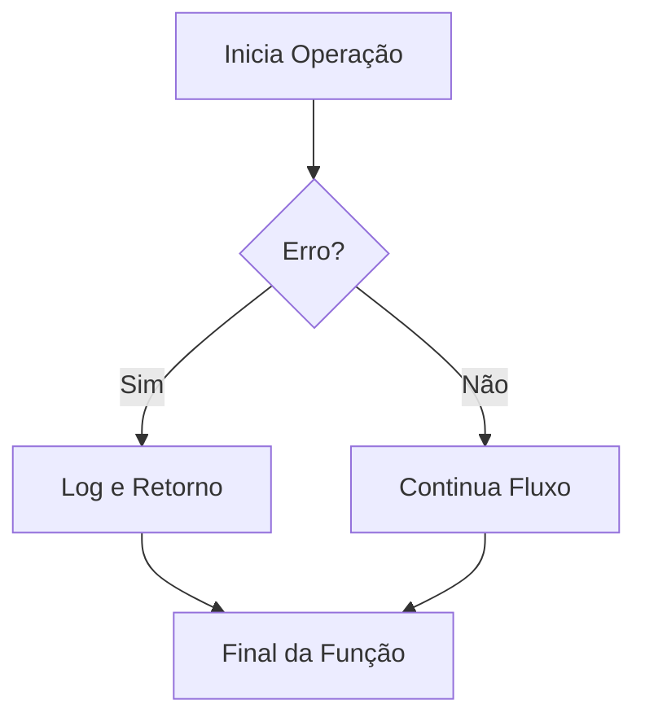

# Aula 06 - Tratamento de Erros ⚠️
## Lidando com Falhas de Forma Idiomática

---

## Agenda de Hoje 📅

1. Filosofia: Erros como Valores <!-- .element: class="fragment" -->
2. O Padrão `if err != nil` <!-- .element: class="fragment" -->
3. Erros Customizados <!-- .element: class="fragment" -->
4. O Poder do `defer` <!-- .element: class="fragment" -->
5. Panic e Recover <!-- .element: class="fragment" -->
6. Mini-Projeto: Validador de Senha <!-- .element: class="fragment" -->

---

## 1. Por que não Try/Catch? 🚫

- Exceções criam fluxos de controle ocultos ("saltos mágicos"). <!-- .element: class="fragment" -->
- Go prefere o tratamento explícito: **"Lide com o erro onde ele ocorre"**. <!-- .element: class="fragment" -->
- Erros são retornos, não interrupções catastróficas. <!-- .element: class="fragment" -->

---

## 2. O Padrão Ouro do Go 🏆

```go
f, err := os.Open("arquivo.txt")
if err != nil {
    return fmt.Errorf("falha ao abrir: %w", err)
}
defer f.Close()
```

- Simples, legível e previsível. <!-- .element: class="fragment" -->

---

## 3. Defer: Adiar para Garantir ⏱️

- Executa no final da função, não importa o que aconteça. <!-- .element: class="fragment" -->
- Ideal para limpeza de recursos (Clean-up). <!-- .element: class="fragment" -->

```go
mu.Lock()
defer mu.Unlock() // Destrava no final, aconteça o que acontecer
```

---

## 4. Diferença Crucial ⚖️

| Erro (Common) | Panic (Fatal) |
| :--- | :--- |
| Validação de dados | Falta de memória |
| Arquivo não encontrado | Erro lógico impossível |
| Timeout de rede | Corrupção de estado |

---

## 5. Fluxo de Tratamento 📊



---

## 6. Mini-Projeto: Validador de Senha 🚀

- Função `Validar(senha string) error`. <!-- .element: class="fragment" -->
- Retorna erros específicos para: <!-- .element: class="fragment" -->
    - Senha curta. <!-- .element: class="fragment" -->
    - Sem números. <!-- .element: class="fragment" -->

---

## Resumo da Aula ✅

- Erros são valores e devem ser verificados. <!-- .element: class="fragment" -->
- O `defer` é seu melhor amigo para evitar vazamento de recursos. <!-- .element: class="fragment" -->
- Reserve o `panic` para o que é realmente fatal. <!-- .element: class="fragment" -->

---

## Próxima Aula: Arquivos e JSON 📁

- Lendo e escrevendo no disco. <!-- .element: class="fragment" -->
- Serialização com Struct Tags. <!-- .element: class="fragment" -->

---

## Dúvidas? 🤔

> "Não apenas trate o erro, dê contexto a ele."
