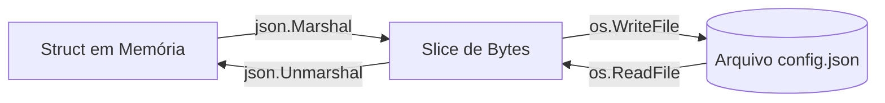

# Aula 07 - Manipulação de Arquivos e JSON 📁
## Persistindo Dados e Comunicando-se com o Mundo

---

## Agenda de Hoje 📅

1. O Pacote `os` e o Sistema de Arquivos <!-- .element: class="fragment" -->
2. Leitura e Escrita de Arquivos <!-- .element: class="fragment" -->
3. Permissões de Acesso (Chmod) <!-- .element: class="fragment" -->
4. Serialização com JSON <!-- .element: class="fragment" -->
5. Struct Tags e Mapeamento <!-- .element: class="fragment" -->
6. Mini-Projeto: CLI To-Do com JSON <!-- .element: class="fragment" -->

---

## 1. Falando com o SO 🖥️

- Go é excelente para ferramentas de linha de comando. <!-- .element: class="fragment" -->
- Pacote `os` abstrai a diferença entre Windows/Linux. <!-- .element: class="fragment" -->

---

## 2. Escrita Simplificada ✍️

```go
texto := "Dados do sistema"
err := os.WriteFile("log.txt", []byte(texto), 0644)
```

- **0644**: Permissão de leitura/escrita padrão. <!-- .element: class="fragment" -->

---

## 3. JSON: A Língua do Backend 🏗️

- Go possui suporte nativo via `encoding/json`. <!-- .element: class="fragment" -->
- **Marshal**: Struct -> JSON. <!-- .element: class="fragment" -->
- **Unmarshal**: JSON -> Struct. <!-- .element: class="fragment" -->

---

## 4. O Poder das Struct Tags 🏷️

- Permite renomear chaves no JSON. <!-- .element: class="fragment" -->

```go
type User struct {
    Nome  string `json:"full_name"`
    Senha string `json:"-"` // Oculta no JSON
}
```

---

## 5. Fluxo de Dados JSON 📊



---

## 6. Mini-Projeto: To-Do List CLI 🚀

- Uma struct `Tarefa` (ID, Texto, Status). <!-- .element: class="fragment" -->
- Salvar um slice de tarefas em `tarefas.json`. <!-- .element: class="fragment" -->
- Ler e exibir ao abrir o programa. <!-- .element: class="fragment" -->

---

## Resumo da Aula ✅

- Go trata arquivos de forma binária (`[]byte`). <!-- .element: class="fragment" -->
- JSON é mapeado diretamente para structs via Tags. <!-- .element: class="fragment" -->
- Defer é vital para liberar o arquivo após o uso. <!-- .element: class="fragment" -->

---

## Próxima Aula: Concorrência ⚡

- Goroutines: Rodando em paralelo. <!-- .element: class="fragment" -->
- Channels: A comunicação segura. <!-- .element: class="fragment" -->

---

## Dúvidas? 🤔

> "Dados são o novo petróleo, mas o JSON é o oleoduto."
