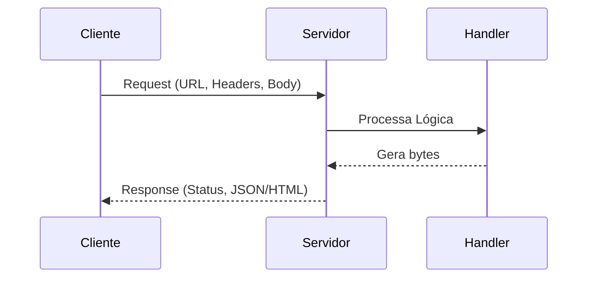

# Aula 09 - Programação Web com net/http 🌐
## Construindo a Base do seu Próprio Servidor

---

## Agenda de Hoje 📅

1. O Pacote `net/http` <!-- .element: class="fragment" -->
2. Handlers: Response vs Request <!-- .element: class="fragment" -->
3. Roteamento Simples <!-- .element: class="fragment" -->
4. Middlewares e Interceptação <!-- .element: class="fragment" -->
5. Servindo Arquivos Estáticos <!-- .element: class="fragment" -->
6. Mini-Projeto: Contador de Visitas <!-- .element: class="fragment" -->

---

## 1. O Servidor Nativo 📡

- Go não precisa de Nginx ou Apache para lógica. <!-- .element: class="fragment" -->
- Binário **independente** e de **alta performance**. <!-- .element: class="fragment" -->

```go
http.ListenAndServe(":8080", nil)
```

---

## 2. Handlers: A Alma da Web 🏗️

```go
func Handler(w http.ResponseWriter, r *http.Request) {
    // w: Onde eu escrevo (Response)
    // r: O que eu recebo (Request)
}
```

---

## 3. Fluxo de uma Requisição 📊



---

## 4. Middlewares 🛡️

- "Camadas de cebola" ao redor do seu código. <!-- .element: class="fragment" -->
- **Aplicações**: <!-- .element: class="fragment" -->
    - Logs de acesso.
    - Verificação de Autenticação.
    - Rate Limiting.

---

## 5. Arquivos Estáticos 📁

```go
fs := http.FileServer(http.Dir("./public"))
http.Handle("/", fs)
```

- Simples, direto e seguro. <!-- .element: class="fragment" -->

---

## 6. Mini-Projeto: Contador de Visitas 🚀

```go
var count int
func Counter(w http.ResponseWriter, r *http.Request) {
    count++
    fmt.Fprintf(w, "Visitas: %d", count)
}
```

---

## Resumo da Aula ✅

- `net/http` é tudo que você precisa para começar. <!-- .element: class="fragment" -->
- ResponseWriter envia, Request recebe. <!-- .element: class="fragment" -->
- Servidores em Go são leves e portáveis. <!-- .element: class="fragment" -->

---

## Próxima Aula: APIs REST Profissionais 🏗️

- Modelagem e Camadas. <!-- .element: class="fragment" -->
- JSON e Verbos HTTP.

---

## Dúvidas? 🤔

> "A Web é feita de requisições e respostas. Go é o mestre de ambas."
