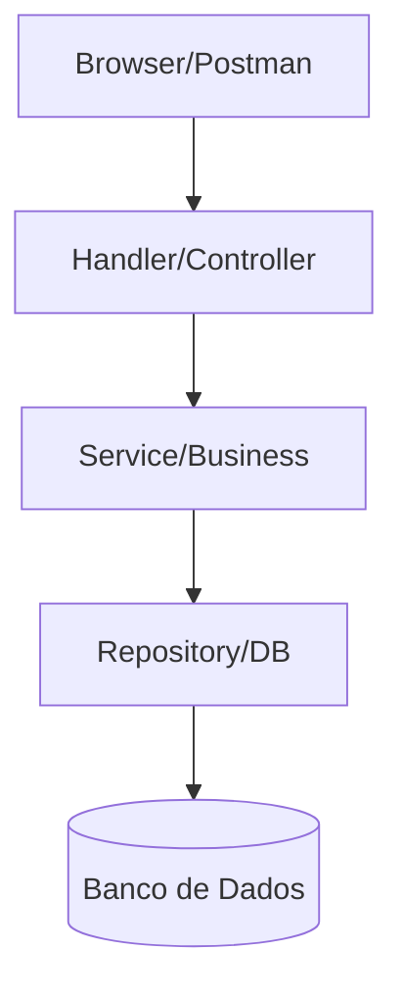

# Aula 10 - Construindo APIs REST 🏗️
## Arquitetura Profissional e Design de Recursos

---

## Agenda de Hoje 📅

1. O que é REST na Prática? <!-- .element: class="fragment" -->
2. Verbos HTTP e Semântica <!-- .element: class="fragment" -->
3. Organização por Camadas (Pattern) <!-- .element: class="fragment" -->
4. Status Codes: A Linguagem da Resposta <!-- .element: class="fragment" -->
5. JSON como Contrato <!-- .element: class="fragment" -->
6. Mini-Projeto: API de Livros <!-- .element: class="fragment" -->

---

## 1. REST: Representational State Transfer 🧊

- É um estilo de arquitetura para sistemas distribuídos. <!-- .element: class="fragment" -->
- **Recurso**: Tudo o que é Nomeável (Substantivo). <!-- .element: class="fragment" -->
- **URI**: O Identificador único (ex: `/usuarios/1`). <!-- .element: class="fragment" -->

---

## 2. Verbos HTTP: As Ações 🎬

| Verbo | Ação | Ideal para... |
| :--- | :--- | :--- |
| **GET** | Ler | Listar ou buscar um item. |
| **POST** | Criar | Inserir novo dado. |
| **PUT/PATCH** | Atualizar | Alterar dados existentes. |
| **DELETE** | Remover | Apagar um recurso. |

---

## 3. Organização Profissional 📂

> "Separe quem recebe o dado de quem decide o que fazer com ele." <!-- .element: class="fragment" -->

- **Handlers**: Tratam o HTTP. <!-- .element: class="fragment" -->
- **Services**: Regras de Negócio. <!-- .element: class="fragment" -->
- **Models/Entity**: A cara do dado. <!-- .element: class="fragment" -->
- **Repository**: Acesso ao Banco de Dados. <!-- .element: class="fragment" -->

---

## 4. Diagrama de Camadas 📊

---

## 5. Status Codes: O Feedback 🚦

- **2xx**: Sucesso (200 OK, 201 Created). <!-- .element: class="fragment" -->
- **4xx**: Erro do Cliente (400 Bad Request, 404 Not Found). <!-- .element: class="fragment" -->
- **5xx**: Erro do Servidor (500 Internal Error). <!-- .element: class="fragment" -->

---

## 6. Mini-Projeto: API de Livros 🚀

- Criar estrutura de pastas. <!-- .element: class="fragment" -->
- Implementar Listagem e Cadastro. <!-- .element: class="fragment" -->
- Separar Structs em um pacote `models`. <!-- .element: class="fragment" -->

---

## Resumo da Aula ✅

- REST usa o protocolo HTTP de forma inteligente. <!-- .element: class="fragment" -->
- Camadas facilitam a manutenção e testes. <!-- .element: class="fragment" -->
- URIs devem ser substantivos, não verbos. <!-- .element: class="fragment" -->

---

## Próxima Aula: Framework Gin 🚀

- Desenvolvimento ultra-rápido. <!-- .element: class="fragment" -->
- Validação automática de JSON.

---

## Dúvidas? 🤔

> "Uma boa API é aquela que se explica sozinha."