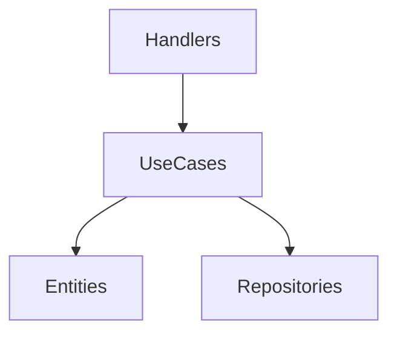

# Aula 14 - Arquitetura e Boas Práticas 🏗️
## Criando Sistemas Escaláveis e Fáceis de Manter

---

## Agenda de Hoje 📅

1. O Caos vs Organização <!-- .element: class="fragment" -->
2. Clean Architecture em Go <!-- .element: class="fragment" -->
3. Injeção de Dependência <!-- .element: class="fragment" -->
4. Estrutura de Pastas (Padrão) <!-- .element: class="fragment" -->
5. Visibilidade e o pacote `internal` <!-- .element: class="fragment" -->
6. Mini-Projeto: Refatorando para DI <!-- .element: class="fragment" -->

---

## 1. Clean Architecture 🧊

- **Mantra**: Independência de Framework e Banco. <!-- .element: class="fragment" -->
- O código de negócio deve ser puro Go. <!-- .element: class="fragment" -->



---

## 2. Injeção de Dependência (DI) 💉

- Não deixe a struct criar seu próprio Repository. <!-- .element: class="fragment" -->
- **Dê** o repositório para ela (via construtor). <!-- .element: class="fragment" -->

```go
func NewService(r Repository) *Service {
    return &Service{repo: r}
}
```

---

## 3. O Pacote `internal` ⚔️

- Protege o seu código de "vazar". <!-- .element: class="fragment" -->
- Apenas pacotes dentro do módulo podem importá-lo. <!-- .element: class="fragment" -->
- **Ideal para**: Lógica de banco e regras internas. <!-- .element: class="fragment" -->

---

## 4. Estrutura de Pastas Profissional 📂

```termynal
$ tree
.
├── cmd/        # Entrypoints
├── internal/   # Core (Business)
├── pkg/        # Shared Libs
└── api/        # Docs/OpenAPI
```

---

## 5. Boas Práticas (Cringe Free) ✨

- Pacotes com nomes curtos: `user`, `auth`. <!-- .element: class="fragment" -->
- Sem `utils` ou `helpers` genéricos. <!-- .element: class="fragment" -->
- Retornos concretos, entradas abstratas. <!-- .element: class="fragment" -->

---

## 6. Mini-Projeto: Refatorando 🚀

- Isolar a struct `Livro` em entitites. <!-- .element: class="fragment" -->
- Criar interface `LivroRepository`. <!-- .element: class="fragment" -->
- Fazer o Handler receber a interface. <!-- .element: class="fragment" -->

---

## Resumo da Aula ✅

- Clean Arch foca no que Realmente Importa (Negócio). <!-- .element: class="fragment" -->
- Injeção de Dependência facilita Testes Unitários. <!-- .element: class="fragment" -->
- Estrutura de pastas reflete a maturidade do time. <!-- .element: class="fragment" -->

---

## Próxima Aula: Docker e Deploy 🐳

- Indo para o mundo real.
- Containers e Infra.

---

## Dúvidas? 🤔

> "A arquitetura é o que permite que você mude de ideia depois."
