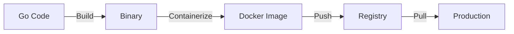

# Aula 15 - Docker e Deploy 🐳
## Do Código Local para a Infraestrutura Moderna

---

## Agenda de Hoje 📅

1. O que é Containerização? <!-- .element: class="fragment" -->
2. Dockerfile para Go <!-- .element: class="fragment" -->
3. Multi-Stage Builds (Otimização) <!-- .element: class="fragment" -->
4. Docker Compose: Multi-Serviços <!-- .element: class="fragment" -->
5. CI/CD e Fluxo de Deploy <!-- .element: class="fragment" -->
6. Mini-Projeto: API no Container <!-- .element: class="fragment" -->

---

## 1. Por que Docker + Go? 🦦

- Go gera binários estáticos. <!-- .element: class="fragment" -->
- Docker garante bibliotecas de sistema e rede. <!-- .element: class="fragment" -->
- **Resultado**: "Build once, run anywhere". <!-- .element: class="fragment" -->

---

## 2. Dockerfile Inteligente 🏗️

```dockerfile
# Estágio de Build
FROM golang:alpine AS builder
WORKDIR /app
COPY . .
RUN go build -o app

# Estágio Final (Lightweight)
FROM alpine:latest
COPY --from=builder /app/app .
CMD ["./app"]
```

---

## 3. Comparativo de Tamanho 📏

- Imagem com Go SDK: **~300MB**. <!-- .element: class="fragment" -->
- Imagem Final (Alpine): **~12MB**. <!-- .element: class="fragment" -->
- **Benefício**: Deploy mais rápido e seguro. <!-- .element: class="fragment" -->

---

## 4. Orquestração com Compose 🎼

```yaml
services:
  api:
    build: .
    ports: ["8080:8080"]
    depends_on: [db]
  db:
    image: postgres:alpine
```

---

## 5. Fluxo de Vida 📊



---

## 6. Mini-Projeto: API no Container 🚀

- Criar `Dockerfile`. <!-- .element: class="fragment" -->
- Rodar `docker build -t minha-api .`. <!-- .element: class="fragment" -->
- Rodar `docker run -p 8080:8080 minha-api`. <!-- .element: class="fragment" -->
- Testar via Postman. <!-- .element: class="fragment" -->

---

## Resumo da Aula ✅

- Multi-stage build é obrigatório para eficiência. <!-- .element: class="fragment" -->
- Docker Compose facilita o setup do desenvolvedor. <!-- .element: class="fragment" -->
- Variáveis de ambiente são a forma correta de configurar. <!-- .element: class="fragment" -->

---

## Próxima Aula: Projeto Final 🏆

- Juntando tudo.
- Desafio Completo.

---

## Dúvidas? 🤔

> "Um container é uma promessa de que o código vai rodar."
